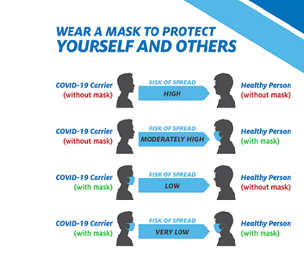
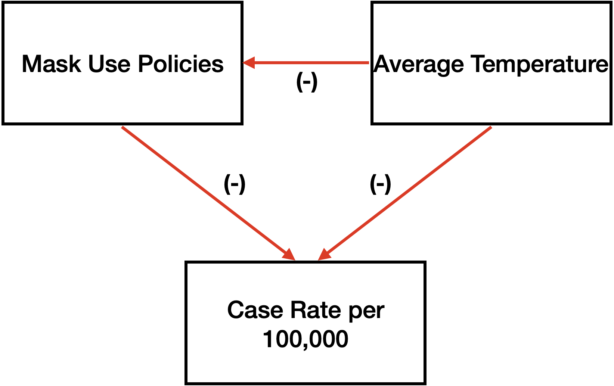
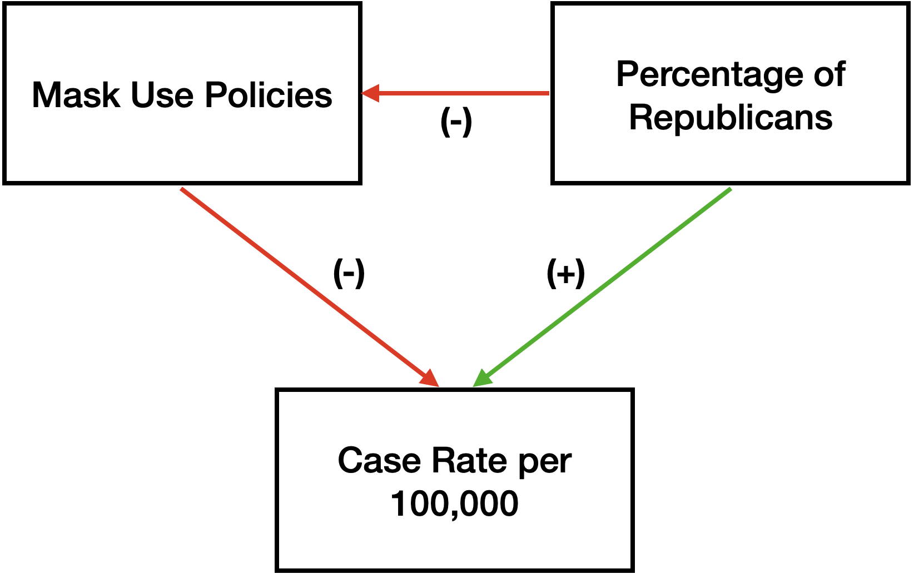

```{r library imports, include = FALSE}
library(tidyverse)
library(lmtest)
library(sandwich)
library(stargazer)
library(knitr)
library(GGally)
library(naniar)
```

```{r data schema, include = FALSE}
schema <- cols(
  state = "c",
  cases_total = "i",
  cases_last_7_days = "i",
  case_rate = "n",
  case_rate_last_7_days = "n",
  deaths_total = "i",
  deaths_last_7_days = "i",
  death_rate = "n",
  death_rate_last_7_days = "n",
  tests_total = "i",
  tests_positive = col_factor(
    levels = c("0-5%", "6-10%", "11-20%"),
    ordered = TRUE
    ),
  test_rate = "i",
  white_cases = "i",
  white_pop = "i",
  black_cases = "i",
  black_pop = "i",
  hispanic_cases = "i",
  hispanic_pop = "i",
  other_cases = "i",
  other_pop = "i",
  white_deaths = "i",
  black_deaths = "i",
  hispanic_deaths = "i",
  other_deaths = "i",
  emerg_date = col_date(format = "%d/%m/%Y"),
  beg_bus_close_date = col_date(format = "%d/%m/%Y"),
  end_bus_close_date = col_date(format = "%d/%m/%Y"),
  bus_close_days = "i",
  beg_shelter_date = col_date(format = "%d/%m/%Y"),
  end_shelter_date = col_date(format = "%d/%m/%Y"),
  shelter_days = "i",
  mask_date = col_date(format = "%d/%m/%Y"),
  mask_use = "l",
  mask_legal = "l",
  beg_maskbus_date = col_date(format = "%d/%m/%Y"),
  end_maskbus_date = col_date(format = "%d/%m/%Y"),
  maskbus_use = "l",
  gov_party = col_factor(
    levels = c("R", "D"),
    ordered = FALSE
  ),
  pop_dens = "n",
  pop_total = "i",
  pre_cond_total = "i",
  serious_illness_pct = "n",
  all_cause_deaths_total = "i",
  homeless_total = "i",
  medicaid_pct = "i",
  life_expectancy = "n",
  unemployment_rate = "n",
  poverty_rate = "n",
  weekly_UI_max_amount = "i",
  household_income = "i",
  age_0_18 = "i",
  age_19_25 = "i",
  age_26_34 = "i",
  age_35_54 = "i",
  age_55_64 = "i",
  age_65 = "i",
  mob_RR = "i",
  mob_GP = "i",
  mob_PK = "i",
  mob_TS = "i",
  mob_WP = "i",
  mob_RS = "i"
)
```

```{r csv import, include = FALSE}
df <- read_delim(
  file = "clean_covid_19_LB_version.csv",
  delim = ";",
  col_names = TRUE,
  col_types = schema,
  na = ""
  )
```

# Introduction

As of the time of this writing, more than 10 million Americans have been infected with the novel coronavirus, of which more than 240,000 have perished. Governments from the local to state to federal level have scrambled to enact policies to regain some semblance of control. Despite all of their efforts, the United States currently leads the globe in both the number of cases and the number of dead by a long shot.

One of the earliest recommendations by health officials to help protect against contracting the virus was to don Personal Protective Equipment (PPE), more specifically face masks. When combined with social distancing, masks were said to drastically reduce the risk of the virus spreading. 



On April 3, the Center for Disease Control (CDC) issued an official recommendation advising all persons to wear a cloth face mask or covering in public to help slow the spread of the coronavirus. Following this guidance, almost every state went on to enact a policy requiring people to wear face masks at all times in public settings. In fact, only 7 states to date have proceeded with no such policy (although many have since ended their order).

Despite these recommendations, the use of face masks has become politicized and undermined by large swaths of the country’s population. Conflicting messaging from government officials, including the President himself, has resulted in a loss of credibility and trust in the CDC. Whether as a result of denial, distrust, or a desire to feel in control, the fact remains that tens of millions of Americans would rather take the risk over wearing a face mask in public. And for all we know, they could be right!

Accordingly, as a team we decided to leverage the provided dataset to validate the guidance from the CDC and answer the following question:

**Does the implementation of a mandatory face mask policy aid in reducing the case rate of COVID-19 in the United States?**

Our measurement goal is to assess the statistical significance and practical significance of mandatory face mask usage policies on reducing the COVID-19 case rate in the United States.

To answer this question, we chose the ‘Case Rate per 100,000’ measure as our outcome variable, and the Face Mask Mandate date column as our measured variable. We operationalized the mandate column by creating a new indicator binary variable, with 0 representing no face mask mandate as of 10/30/2020 and 1 representing having a face mask mandate policy in place on or before 10/30/2020. In conjunction with considering the case rate, we also know that the Test Rate per 100,000 measure is extremely important to include given that a positive case cannot be identified sans testing. These three variables constitute our base case model to help explain whether mandatory face mask usage has a measurable impact on the COVID-19 case rate.

# Data Summary and Cleaning

The data used in the model is taken from the provided covid_19 dataset. The provided dataset is up-to-date as of October 30th, 2020. Below are the adjustments made to variables that were either created or supplemented.

**Mask Use**

This binary/logical variable was created by assigning a 1 if the state had a mask mandate and 0 if it did not (based on the mask mandate date column). Some of the data from the mask mandate was missing and was manually research and populated.

**Percent Age Below 25**

This column was created by combining the 0-18 and 18-25 age groups. No other adjustments were made.

**Days in Shelter-in-Place**

The number of days each state was under the Shelter-in-Place mandate. This data was missing some data and supplemented by researching and populating the missing data. The column was creating by subtracting the end and start dates.

**Days Businesses Closed**

The number of days each state closed non-essential businesses. Similar to the days in SIP, missing data was populating through research of the state's specific mandates, then calculated by subtracting the end and start dates.

**Percentage of Population: Black**

Observations that were marked as "< 0.01" were rounded up to 0.01 for a log transformation to be applied.

# Data Structure

There are a total of 6 data types in the dataset: character, numeric, integer, factor, dates, and logical. Any variable with “date” in the name is read in as a date. Logical variables include mask_use, mask_legal, and maskbus_use. Variables read in as factors include gov_party, and tests_positive. The only character variable is the state name. Finally, all other variables are read in as either numeric or an integer. All numeric and integer values are real and nonnegative.

# Distribution of Numeric and Integer Variables

The summary table of the numeric and integer variables show that there are no obvious errors to the dataset.

```{r}
#for (i in seq(seq(1,length(df),6))){
#df[,i:i+5] %>%
#  select(where(is.numeric)) %>%
#  summary()
#}

df %>%
  select(where(is.numeric)) %>%
  summary()
```

# Missing Values

```{r}
vis_miss(df)
```

Missing values were treated on a case-by-case basis. Many of the missing values could be populated through research (e.g., when did state X go into shelter-in-place?) 

# Exploratory Data Analysis

The initial exploration of our data is driven by our main dependent variable - case rate per 100k - and independent variable - a policy for mandatory mask use. Based on our causal model, a mask-use policy should lead to a decrease in the number of covid cases. The boxplot below suggests that this initial assumption at least holds to some degree.

```{r case rate vs mask use, warning=FALSE}

df %>%
  ggplot(aes(y = case_rate, x = mask_use)) +
  geom_boxplot() +
  labs(
    title = "Relationship between Mandatory Mask Use and Case Rate by state",
    x = "Mandatory Mask Use",
    y = "Case Rate per 100K"
  )
```

It is also expected that the more a state is able to provide tests, the higher the case rate will tend to be. This idea is supported 

```{r warning=FALSE}

df %>%
  ggplot(aes(y = case_rate, x = test_rate)) +
  geom_point() +
  labs(
    title = "Relationship between Test Rate and Case Rate by state",
    x = "Test Rate per 100k",
    y = "Case Rate per 100K"
  )
```

To find the other control variables that best demonstrated the use of masks, we grouped similar variables together to find which variable, or group of variables, had the combination of highest correlation with case rate per 100k, and low collinearity with other variables. 

We plot the correlation between case rate per 100k and the percent population of various ethnic groups. The correlation plot shows that the case rate per 100k variable has the highest correlation with the black population variable.

```{r warning=FALSE, message=FALSE}
ggpairs(data = df, columns = c(4,seq(14,20,2)))
```

Next, we look at case rate per 100k and the duration that people in the US had to shelter in place  (SIP) and businesses had to close (if at all). From the correlation plots below, the number of days that people had to SIP and the number of days a business had a negative correlation with case rate per 100k, meaning the more days of SIP and businesses had to close, the lower the case rate tended to be. Another set of interesting variables are the beginning shelter date and business close date. The general correlation shows that the later a state started closures, the higher the case rate per 100k it tended to have.

```{r warning=FALSE, message=FALSE}
ggpairs(data = df, columns = c(4,25:28))
ggpairs(data = df, columns = c(4,29:31))
```

From the figure below we can see that most variables have a correlation of less than 12% with case rate per 100k. The exception may be the political leaning of the political party. The density plot and boxplot of case_rate ~ gov_party visually suggests that a relationship may exist. 

```{r warning=FALSE, message=FALSE}
ggpairs(data = df, columns = c(4,38:43))
```

Poverty rate and household income have decent correlation with case rate and are not colinear with each other. Life expectancy and weekly unemployment max amount have high correlation with the case rate but are highly colinear poverty rate. 
```{r warning=FALSE, message=FALSE}
ggpairs(data = df, columns = c(4,44:50))
``` 

The extreme age groups, 0-18, 19-25, 55-64, and 65+, have the highest correlation with case rate per 100k. There is also significant colinearity across the age groups as well, so additional steps such as combining or excluding age groups may occcur.

```{r warning=FALSE, message=FALSE}
ggpairs(data = df, columns = c(4,51:56))
``` 

Finally, from the Google Mobility report, we see that the change in mobility of transit stations has the highest correlation with case rate per 100k. Each mobility statistic is highly colinear with one another.

```{r warning=FALSE, message=FALSE}
ggpairs(data = df, columns = c(4,57:62))
``` 

COVID-19 is a virus that spreads from person to person and the first stop gaps implemented were the closing of non-essential businesses and a Shelter-in-Place (SIP) mandate. A square-root transformation of the data better interprets the data as the correlation increases. It suggests that there may be a diminishing return for each additional day sheltered in place.

```{r warning=FALSE}
df %>%
  ggplot(aes(y = case_rate, x = shelter_days)) +
  geom_point() +
  labs(
    title = "Relationship between Days Sheltered-in-Place and Case Rate by state",
    x = "Number of Days in SIP",
    y = "Case Rate per 100K"
  )

df %>%
  ggplot(aes(y = case_rate, x = sqrt(shelter_days))) +
  geom_point() +
  labs(
    title = "Relationship between sqrt(Days Sheltered-in-Place) and Case Rate by state",
    x = "sqrt Number of Days in SIP",
    y = "Case Rate per 100K"
  )
  
sip <- lm(case_rate ~ shelter_days, data = df)
sqrt_sip <- lm(case_rate ~ sqrt(shelter_days), data = df)
summary(sip)$r.squared
summary(sqrt_sip)$r.squared
```

Similarly, the number of days a non-essential business was closed would greatly reduce the number of human-human interactions.

```{r warning=FALSE}
df %>%
  ggplot(aes(y = case_rate, x = bus_close_days)) +
  geom_point() +
  labs(
    title = "Relationship between Days Businesses Closed and Case Rate by state",
    x = "Number of Days Businesses Closed",
    y = "Case Rate per 100K"
  )
```

One interesting interaction that was seen in the correlation plots was that the states who implemented shelter-in-place earlier tended to see a lower case rate per 100k.

```{r warning = FALSE}
df %>%
  ggplot(aes(y = case_rate, x = beg_shelter_date)) +
  geom_point() + 
  labs(
    title = "Relationship between start of SIP and case rate by state",
    x = "Start of SIP",
    y = "Case Rate per 100k"
  )

sipstart <- lm(case_rate ~ beg_shelter_date, data = df)
busclosestart <- lm(case_rate ~ beg_bus_close_date, data = df)
summary(sipstart)$r.squared
summary(busclosestart)$r.squared
```

The number of positive cases a state has is strictly dependent on the number of tests administered. From the scatter plot below, we do see a positive relationship between the number of tests administered and the number of cases. Log and square-root transformations do not lead to a higher correlation therefore the variable is left as is.

```{r test_rate linear relationship, warning=FALSE}
df %>%
  ggplot(aes(y = case_rate, x = test_rate)) +
  geom_point() +
  labs(
    title = "Relationship between Test Rate and Case Rate by state",
    x = "Test Rate per 100K",
    y = "Case Rate per 100K"
  )
```

Next, we look at the correlation between case rate and age. From the covariance matrix below, age groups 0-18 and 65+ are not only the most extreme of the age groups, but covariances as well.

```{r variance-covariance matrix of case_rate vs. age variables, warning=FALSE}
var(df[ ,c(4, 51:56)], na.rm=TRUE)
```

```{r warning = FALSE}
df$age_below_25 = df$age_0_18 + df$age_19_25
df$age_above_54 = df$age_55_64 + df$age_65
df %>%
  ggplot(aes(y = case_rate, x = age_below_25)) +
  geom_point() +
  labs(
    title = "Relationship between Pct Below 25 and Case Rate by state",
    x = "% of Population Below 25",
    y = "Case Rate per 100K"
  )

df %>%
  ggplot(aes(y = case_rate, x = age_above_54)) +
  geom_point() +
  labs(
    title = "Relationship between Pct above 54 and Case Rate by state",
    x = "% of Population Above 54",
    y = "Case Rate per 100K"
  )
```

We also examine the case rate vs ethnicity. The black population is much more correlated with case rate than any of the other ethnic groups. Being white is also negatively correlated with the case rate.

```{r variance-covariance matrix of case_rate vs. ethnicity, warning=FALSE}
var(df[ ,c(4,14,16,18,20)], na.rm=TRUE)
```

We more closely examine the correlation between black population percentage, the most highly correlated ethnicity variable, and case rate. From the graph below, we see that there is a slightly concaving arc as the proportion of black increases.

```{r warning = FALSE}
df$black_pop[df$black_pop == 0] = 0.01
df %>%
  ggplot(aes(y = case_rate, x = black_pop)) +
  geom_point() +
  labs(
    title = "Percentage Black Ethnicity in Total Population and Case Rate by state",
    x = "% of Population - Ethnicity: Black",
    y = "Case Rate per 100K"
  )

df %>%
  ggplot(aes(y = case_rate, x = log(black_pop))) +
  geom_point() +
  labs(
    title = "Log Percentage Black Ethnicity in Total Population and Case Rate by state",
    x = "Log(% of Population - Ethnicity: Black)",
    y = "Case Rate per 100K"
  )

blk_pop <- lm(case_rate ~ black_pop, data = df)
log_blk_pop <- lm(case_rate ~ log(black_pop), data = df)
summary(blk_pop)$r.squared
summary(log_blk_pop)$r.squared
```

The Google Human mobility data is compiled daily by Google and includes information on the amount of time spent at various public locations compared to Google's baseline data. Some of this data is included in the dataset and assumed that it was taken the same day the rest of the dataset was compiled on October 30th, 2020. We find that the highest correlation of the mobility variables lies with the change in Transit Stations (mob_TS). Oddly enough, Wyoming is one of three states with a positive change in transit station use. Wyoming also has by far the largest change at 21% with South Dakota next at 3%. 

```{r variance-covariance matrix of case_rate vs. mobility variables, warning=FALSE}
var(df[ ,c(4, 57:62)], na.rm=TRUE)
```

```{r warning= FALSE}
df %>%
  ggplot(aes(y = case_rate, x = mob_TS)) +
  geom_point() +
  labs(
    title = "Relationship Between Human Mobility: Transit Stations and Case Rate by state",
    x = "Percentage Change in Human Mobility: Transit Stations",
    y = "Case Rate per 100K"
  )
```

# Causal Diagram

Taking into account the trends observed from the plots in the exploratory data analysis, we chose the best control variables and their various transformations to supplement the main dependent and independent variables. The final causal model is shown below. In blue is case rate per 100k, the main dependent variable. We hypothesize that mandatory mask policies (green) have a causal effect on the case rate per 100k. In yellow are the control variables that we use. Finally, in red we have all the other terms combined as a single error term.


# Model Building

## Model 1

### Model description

Our first regression model has **Covid-19 Case Rate per 100,000 habitants** as our outcome variable and two covariates: our variable of interest (**Mandatory Mask Use**) and **Test Rate per 100,000 habitants**.  

We have included **Test Rate** because we've seen before there is variability in the test rates among US states which could potentially affect the integrity of our outcome variable - e.g. states presenting lower case rate not because actual infection rate by covid is lower, but because test availability is lower. In order to mitigate such shortcomings we decided to have **Test Rate** as an independent variable since the very first version of our regression model.  

Our Model 1 has the format: 

case_rate = $\beta_0$ + $\beta_1$ * mask_use + $\beta_2$ * test_rate  

### Model summary

```{r model_1 summary, warning = FALSE}
model_1 <- lm(case_rate ~ mask_use + test_rate, data = df)
std_errors = sqrt(diag(vcovHC(model_1)))
stargazer(model_1, se = std_errors, type = "latex", title = "Model 1 Summary")
```


### Overall model significance (F-test)

Under a significance level of 0.05, we can reject the null hypothesis ($H_0: \beta_1 = \beta_2 = 0$) in favor of our fuller model ($H_a: \beta_1 \ne 0$ and $\beta_2 \ne 0$), which now includes the covariates **mask_use** and **test_rate**. The F-Statistic = 7.416, and the p-value < 0.01. Our Model 1 has an adjusted R-squared of 0.204.  

### Coefficient significance (t-test)  

Under a significance level of 0.05, we can accept the alternative hypotheses $H_{a1}: \beta_1 \ne 0$ and $H_{a2}: \beta_2 \ne 0$, which means both of our covariates do explain part of the variability observed in the **case_rate**.  

Our estimate for $\beta_1$ (the coefficient of our variable of interest) is $\tilde \beta_1 = -990.5$, with a standard error of 307.0 and a p-value of 0.002.  

```{r model_1 coefficient test}
coeftest(model_1, vcovHC = vcovHC(model_1, type = "HC3"))
```

### Practical significance  

According to Model 1, states that have adopted mandatory mask use would expect to have -990.5 covid cases per 100,000 habitants. Given that the median of covid case rate among US states is of 2,633 per 100,000 habitants, with 1st Quartile = 2,040 and 3rd quartile = 3,516, the coefficient estimate has practical significance, with an effect size corresponding to a reduction of 37.6% of the median of the covid case rate among states.  

## Model 2

### Model description

Our second regression model has **Covid-19 Case Rate per 100,000 habitants** as our outcome variable and five covariates: our variable of interest (**Mandatory Mask Use**), **Test Rate per 100,000 habitants**, **Percentage of Population Below 25 Years Old**, **Log of Percentage of Black Ethnicity in Total Population**, and **Human Mobility Change in Transit Stations**.  

Model 2 represents our best understanding of the relationship among the variables, striking a balance between accuracy and parsimony. Our variable of interest continues to be **Mandatory Mask Use** and our measurement goal continues to be to assess the significance and practical impact of **Mandatory Mask Use** in the **Case Rate**. The other mediating variables we added to the model work like *controls* in order to allow us to better capture the significance and practical relevance of the **Mandatory Mask Use** in the decrease of **Case Rate**.    

Our Model 2 has the format: 

case_rate = $\beta_0$ + $\beta_1$ * mask_use + $\beta_2$ * test_rate + $\beta_3$ * age_below_25 + $\beta_4$ * log(black_pop) + $\beta_5$ * mob_TS  

### Model summary

```{r model_2 summary, warning = FALSE}
model_2 <- lm(case_rate ~ mask_use + test_rate + age_below_25 + log(black_pop) + mob_TS, data = df)
std_errors = list(
  sqrt(diag(vcovHC(model_1))),
  sqrt(diag(vcovHC(model_2)))
)
stargazer(model_1, model_2, se = std_errors, type = "text", title = "Model 2 Summary")
```


### Overall model significance (F-test)

Under a significance level of 0.05, we can reject the null hypothesis (**Model 1**) in favor of our fuller **Model 2**, which now includes the covariates **mask_use**, **test_rate**, **age_below_25**, **log(black_pop)**, and **mob_TS**. The F-Statistic = 16.258, and the p-value < 0.01. Our Model 2 has an adjusted R-squared of 0.593. Our residual standard error decreased from 1,013.8 to 725.3. **Model 2** is the most robus model we will build in the scope of this study.  

```{r model_2 F-test}
anova(model_1, model_2, test = "F")
```


### Coefficient significance (t-test)  

Under a significance level of 0.05, we can accept the alternative hypotheses: $H_{a1}: \beta_1 \ne 0$, $H_{a2}: \beta_2 \ne 0$, $H_{a3}: \beta_3 \ne 0$, and $H_{a4}: \beta_4 \ne 0$, which means 4 out of 5 of our covariates do explain part of the variability observed in the **case_rate**.  

Our estimate for $\beta_1$ (the coefficient of our variable of interest) is $\tilde \beta_1 = -961.4$, with a standard error of 240.0 and a p-value of 0.0002. It continues to be statistically significant and with an estimated value that changed little from **Model 1** (-990.5) to **Model 2** (-961.4).

```{r model_2 coefficient test}
coeftest(model_2, vcovHC = vcovHC(model_2, type = "HC3"))
```

### Practical significance  

According to Model 2, states that have adopted mandatory mask use would expect to have -961.4 covid cases per 100,000 habitants. Given that the median of covid case rate among US states is of 2,633 per 100,000 habitants, with 1st Quartile = 2,040 and 3rd quartile = 3,516, the coefficient estimate has practical significance, with an effect size corresponding to a reduction of 36.5% of the median of the covid case rate among states.

## Model 3

### Model description

Our third regression model has **Covid-19 Case Rate per 100,000 habitants** as our outcome variable and seven covariates: our variable of interest (**Mandatory Mask Use**), **Test Rate per 100,000 habitants**, **Percentage of Population Below 25 Years Old**, **Log of Percentage of Black Ethnicity in Total Population**, 
**Human Mobility Change in Transit Stations**, **Number of Days of Shelter in Place**, and **Number of Days of Non-Essential Businesses Closure**.  

**Model 3** includes the previous covariates, and other new 2 covariates, erring on the side of inclusion. A key purpose of **Model 3** is to demonstrate the robustness of the results of our measurement goal ($\tilde \beta_1$). New variables on **Model 3** represent other commom policies US states have adopted to combat the virus spread. They have some collinearity with mask use as it would be expected, since typically a state enact not a single, but a set of policies against covid-19.  

Despite the fact that **Model 3** loses some explanatory power due to the inclusion of the new variables, the result we would like to highlight is that our coeficient of interest ($\tilde \beta_1$) continued to be both statistically significant, and with an estimated value that has practical significance in terms of informing public policies in the combat to the virus.  

**Model 3** main role was to work as an *acid test* of the relevance of mandatory mask use in reducing the case rate of covid 19 among US states. And, in this sense, it helped us to confirm the robustness of our study results.  

Our Model 3 has the format: 

case_rate = $\beta_0$ + $\beta_1$ * mask_use + $\beta_2$ * test_rate + $\beta_3$ * age_below_25 + $\beta_4$ * log(black_pop) + $\beta_5$ * mob_TS + $\beta_6$ * shelter_days + $\beta_7$ * bus_close_days  

### Model summary

```{r model_3 summary, warning = FALSE}
model_3 <- lm(case_rate ~ mask_use + test_rate + age_below_25 + log(black_pop) + mob_TS + shelter_days + bus_close_days, data = df)
std_errors = list(
  sqrt(diag(vcovHC(model_1))),
  sqrt(diag(vcovHC(model_2))),
  sqrt(diag(vcovHC(model_3)))
)
stargazer(model_1, model_2, model_3, se = std_errors, type = "text", title = "Model 3 Summary")
```


### Overall model significance (F-test)

Under a significance level of 0.05, we can not reject the null hypothesis (**Model 2**) in favor of our fuller **Model 3**, which now includes the covariates **shelter_days** and **bus_close_days**. Our Residual Std. Error almost remained the same, even with the inclusion of two new variables. This demonstrates that there is collinearity between our new variables and the old ones. The inclusion of the new variables did not help to increase the explained variability of the outcome variable. The adjusted R-squared of **Model 3** is of 0.572.   

On the other hand, as it was asserted above, our focus of interest on **Model 3** is not on the overall roustness of the model (for that sake we have **Model 2**), but more on performing an *acid test* around the statistical and practical significance of our coeficient of interest ($\tilde \beta_1$).


### Coefficient significance (t-test)  

Under a significance level of 0.05, we can accept the alternative hypotheses: $H_{a1}: \beta_1 \ne 0$, $H_{a3}: \beta_3 \ne 0$, and $H_{a4}: \beta_4 \ne 0$, which means only 3 out of 7 of our covariates do explain part of the variability observed in the **case_rate**.  

Our estimate for $\beta_1$ (the coefficient of our variable of interest) is $\tilde \beta_1 = -940.7$, with a standard error of 284.9 and a p-value of 0.0006. It continues to be statistically significant and with an estimated value that changed little from **Model 2** (-961.4) to **Model 3** (-940.7).

```{r model_3 coefficient test}
coeftest(model_3, vcovHC = vcovHC(model_3, type = "HC3"))
```

### Practical significance  

According to Model 3, states that have adopted mandatory mask use would expect to have -940.7 covid cases per 100,000 habitants. Given that the median of covid case rate among US states is of 2,633 per 100,000 habitants, with 1st Quartile = 2,040 and 3rd quartile = 3,516, the coefficient estimate has practical significance, with an effect size corresponding to a reduction of 35.7% of the median of the covid case rate among states.

## CLM Assumptions & Limitations

1) Independent & Identically Distributed Random Variables

Our data set is inherently guilty of being geographically clustered as it only focuses on samples (in this case, states) within the United States. While each of these states have the authority on whether or not to enact a mandated face mask policy, they all share a common federal government and leader in the form of the President. Consequently, our research question is specifically framed to only focus on the effect of mandatory face mask policies on the COVID-19 case rate within the United States. 

2) Linear Conditional Expectation

To assess linear conditional expectation, we need to examine the residuals for our independent variables in each model.

```{r message=FALSE, echo = TRUE}

model_1_residuals = resid(model_1)
model_2_residuals = resid(model_2)
model_3_residuals = resid(model_3)

plot_1_residuals <- model_1 %>%  
  ggplot(aes(x = case_rate, y = model_1_residuals)) + 
  geom_point() + stat_smooth(se = TRUE)

plot_2_residuals <- model_2 %>%  
  ggplot(aes(x = case_rate, y = model_2_residuals)) + 
  geom_point() + stat_smooth(se = TRUE)

plot_3_residuals <- model_3 %>%  
  ggplot(aes(x = case_rate, y = model_3_residuals)) + 
  geom_point() + stat_smooth(se = TRUE)

plot_1_residuals
plot_2_residuals
plot_3_residuals

```

We are able to observe a clear linear pattern when plotting the predicted values against the corresponding residuals for each model; in fact, the mean becomes increasingly centered around 0 with each iteration. While we cannot assertively state that our model(s) meet the linear conditional expectation assumption, we can fail to reject the null hypothesis that there is an inherent issue in making that assumption.

3) No Perfect Collinearity

As far as perfect collinearity goes, we can safely assume that our models meet this assumption of the CLM given that our models all run without dropping any variables. However, when trying to evaluate near-perfect collinearity, it becomes a slightly more involved exercise.

Thinking about the variables we added between Model 2 and Model 3 (shelter_days and bus_close_days), one might point out that there is a high level of correlation between those variables and our primary independent variable of a mandated face mask policy. However, it is important to note that we are purposefully adding those variables to the mix in order to demonstrate the robustness of Model 2.

If we re-examine the Model 3 Summary, we note that even with the addition of the shelter_days and bus_close_days variables, we still maintain a relatively constant coefficient for mask_use variable (-961 in Model 2 versus -941 in Model 3). Coefficients of our other variables also remain relatively unchanged. Additionally, it is clear that collinearity is introduced in Model 3 because the standard errors for several of the variables increases as compared with Model 2.

```{r model_3 reexamination, warning = FALSE}
model_3 <- lm(case_rate ~ mask_use + test_rate + age_below_25 + log(black_pop) + mob_TS + shelter_days + bus_close_days, data = df)
std_errors = list(
  sqrt(diag(vcovHC(model_1))),
  sqrt(diag(vcovHC(model_2))),
  sqrt(diag(vcovHC(model_3)))
)
stargazer(model_1, model_2, model_3, se = std_errors, type = "text", title = "Model 3 Summary")
```

4) Heteroscedastic Conditional Variance

To test for heteroscedasticity, or non-constant variance, we must perform the Breusch-Pagan test on each of our models. Our null hypothesis is that there is no evidence for heteroscedastic variance.

Running the test for Model 1, we observe a high p-value of 0.7. While we cannot assertively state that there is no heteroscedastic variance, we can safely assume that we fail to reject the null hypothesis.

```{r message=FALSE, echo = TRUE}
lmtest::bptest(model_1)
```

Continuing on to running the Breusch-Pagan test for Model 2, we now observe a very low p-value of ~0.008, and reject the null hypothesis. Although this indicates that our data is heteroscedastic, it is important to note that we are utilizing Robust Standard Errors versus Classical Standard Errors in not just Model 2, but all of our models and their associated tests.

```{r message=FALSE, echo = TRUE}
lmtest::bptest(model_2)
```

Finally in Model 3, running the BP test again yields a low p-value of ~0.02, and we reject the null hypothesis. This once again indicates that our data is heteroscedastic, but as mentioned previously we solve for this by utilizing Robust Standard Errors in our model and associated tests.

```{r message=FALSE, echo = TRUE}
lmtest::bptest(model_3)
```

5) Normally Distributed Errors

The final CLM assumption we must test for is normally distributed errors. In order to do this, we will run quantile-quantile plots for each of our models to examine whether the residuals follow a straight line; if so, we can say that they are normally distributed.

```{r message=FALSE, echo = TRUE}

plot(model_1, which = c(2,2))
plot(model_2, which = c(2,2))
plot(model_3, which = c(2,2))

```

As seen above, we can see that the residuals for all 3 models do follow a straight line pattern within their respective Normal Q-Q plots. Accordingly, we can safely assume that our models satisfy this assumption. 


# Omitted Variables Discussion

As we are attempting to study an exceedingly-complex real life phenomenon, naturally there will be an element of bias in our models. We selected what we believed to be the most appropriate variables influencing the COVID-19 case rate per 100,000, which included a range of logistical, social, ethnic and population-based metrics (as provided in the dataset). Nevertheless, even though the dataset was extensive, it is impossible to completely predict every factor that might influence both our dependent variable and independent variables - this is reflected in the model performance metrics (for example $R^2$, which would be 1 if our model perfectly represented the real world phenomenon we were trying to model) and error parameter. 

As such, we have selected several omitted variables that we believe to contribute to the COVID-19 case rate and our chosen explanatory variable of interest, i.e. whether or not a State implemented mandatory mask use laws. These are all envisaged real-world phenomena that we do not have any information regarding. Though we can predict the potential relationship between the omitted variables and the dependent and independent variables for all of our suggested omitted variables. 

The seven independent variables included in our most complete model are **Mandatory Mask Use**, **Test Rate per 100,000 inhabitants**, **Percentage of Population Below 25 Years Old**, **Log of Percentage of Black Ethnicity in Total Population**, and **Human Mobility Change in Transit Stations**. We will discuss how the potential omitted variables relate to our outcome variable and the explanatory variable of interest, **Mandatory Mask Use**. 

In the final model, the coefficient for Mandatory Mask Use is ~-941, with a S.E. of of ~285 and a p-value of < 0.01. This can be interpreted to mean that ***ceteris paribus***, a state that enforces mandatory mask use laws reduces the overall case rate by ~941/100,000 or ~1%. 

## Skepticism Towards COVID-19 Control Policies

There is a documented segment of the population that are skeptical towards the existence of COVID-19$^1$. They may view subsequent governmental efforts to control its spread as a conspiracy. In the provided dataset, we do not have any data pertaining to the proportion of people in any State that are COVID-19 skeptics (if it can even be quantitatively measured). Nevertheless, in an ideal world if we could quantify this metric, we predict that the more skeptics there are in a State, the less likely they will be to observe preventative public-health measures and will thus contract COVID-19 at a higher rate. Therefore, we predict a positive relationship between the State population of COVID-19 skeptics and the case rate per 100,000. 

Similarly, the more COVID-19 skeptics there are among a State's poulation, the more likely it is that their elected local government will align themselves with their views and resist enforcement of mandatory mask usage policies. We therefore predict a negative relationship between the population of COVID-19 skeptics in a State and State enforcement of mandatory mask laws.

As the relationship between the omitted variable and the dependent variable is positive, while the relationship between the omitted variable and the explanatory variable in question is negative, the overall effect of the omitted variable bias will be negative. If we could gather information about a State's population of COVID-19 skeptics and add this variable to our model, doing so would cause the coefficient for mandatory mask use to increase, or move towards 0. 


{width=300px}


## State Healthcare Infrastructure

The standard of healthcare infrastructure may vary across States. For example, there may be fewer healthcare facilities in largely rural States, compared to those that are more urban. As a result, populations in States with poorer healthcare infrastructure may not have easy access to COVID testing or diagnosis. If we could measure and quantify this a State healthcare infrastructure metric, we predict that it would be postively related to COVID-19 case rate per 100,000 population. That is, the higher the theoretical "State healthcare infrastructure" score, the higher number of COVID-19 tests performed, translating to a higher positive case rate. 

Similarly, governments in States with poor healthcare infrastructure might be worried about their population being unable to access treatment for COVID-19, and might be more likely to enact efforts to prevent its spread among the population, which may include enforcing mask use. We therefore predict a negative relationship between a theoretical "State healthcare infrastructure" score and enforcement of laws requiring use of face masks. 

As the relationship between the omitted variable and the independent variable is positive, and the relationship between the omitted variable and and dependent variable is negative, overall omitted variable bias effect is predicted to be negative. If we could compute a "State healthcare infrastructure" metric and include it in our model, its addition would cause the mandatory mask use coefficient to increase, or move towards 0. 

{width=300px}

## Travel Restrictions

Certain states have imposed travel restrictions to prevent the spread of COVID-19$^2$. These may vary from recommending visitors to quarantine, to requiring them to provide proof of a negative COVID-19 test before being granted entry. We therefore predict that these measures to prevent the spread of COVID-19 are negatively related to the case rate per 100,000 population. That is, States that have enforced some kind of travel restriction have fewer overall cases. 

Similarly, if a State government is ready to impose travel restrictions, they are also likely to enforce other public health measures such as mandatory wearing of face masks in public places. Therefore we predict a positive relationship between State enforcement of travel restrictions and implementation of mandatory face mask policies. 

As the relationship between the omitted variable and the dependent variable is negative, and the relationship between the omitted variable and the independent variable is positive, we predict an overall negative omitted variable bias on the model. By adding a variable pertaining to State enforcement of travel restrictions to the model, we would expect to see an increase in the mandatory mask use coefficient. As it is negative in the existing model, we would expect to see it move towards 0. 


{width=300px}


## Average Temperature 

It is thought that the dry air occuring in cold weather enhances the spread of the flu virus$^3$. Certain States in the U.S. have cooler average climates than others, and may also experience colder winters. We therefore predict that there is a negative relationship between a State's average temperature and the positive case rate per 100,000 population. 

Similarly, a local government is likely aware of the link between cooler temperatures and viral spread, and are therefore more likely to enact mandatory mask use policies to mitigate this phenomenon. We therefore predict that the lower a State's average temperature, the more likely the government will be to enforce mandatory mask use policies, a negative relationship. 

As the relationship between the omitted variable and both the dependent and independent variables is negative, the overall effect of the average temperature omitted variable will be positive. That is, if we add an average temperature variable to our model, we would expect to see a decrease in the coefficient for mandatory mask use. As the mandatory mask use coefficient is already negative, we would expect it to become more negative or move further away from 0.

{width=300px}

## Percentage of Republican Voters

There is evidence to show that States that are majority Republican are experiencing the majority of new COVID-19 infections. Though the reasons for this are likely complex, it has been demonstrated, for example, that Republican voters are less likely to observe social distancing regulations, relative to Democratic voters$^4$. We therefore predict that there is a positive relationship between proportion of Republican-voting population in a State and the positive case rate per 100,000 people. 

Similarly, States with a majority of Republican-leaning voters are likely to elect Republican officials who will pander to their voter base. We therefore predict that States with a higher percentage of Republican voters, will be less likely to enforce mandatory mask use laws i.e. a negative relationship.

As there is a positive relationship between the omitted variable (% of Republican voters) and the dependent variable, and a negative relationship between the omitted variable and the independent variable, the overall omitted variable bias will be negative. If we include the proportion of Republican voters as a variable in our model, we would expect to see the coefficient for mandatory mask use to increase or move towards 0. 

{width=300px}

# Conclusion

COVID-19 is not a disease to take lightly. As the death toll and case rate continues to mount, we must collectively work together to slow the spread. Our modeling above concludes that the implementation of a mandatory face mask policy is effective in reducing the COVID-19 case rate by upwards of 900 cases per 100,000 residents within the United States. 

Our exploratory data analysis helps inform how we chose the variables we did, ranging from age to race to mobility data elements. Leveraging those variables, our second and most optimal model achieved an adjusted $R^2$ value of nearly 60%. Further controlling for other policy variables such as shelter-in-place and closure of businesses did not erode the adjusted $R^2$ value very much (57%), and the residual standard error remained nearly constant. As demonstrated in the progression of our modeling, the statistical significance and practical significance remain robust even with the addition of several other variables. They also meet the assumptions of the CLM. Finally, we chose a healthy variety of omitted variables to assess potential bias on our primary model coefficients. 

The next few months will be crucial for the country to course correct until the widespread availability and administration of a safe vaccine. We have already lost far too many of our fellow citizens to this disease. 

Wear a mask. Slow the spread.

# References

1. Whatley, Z., Shodiya, T., **Why So Many Americans Are Skeptical of a Coronavirus Vaccine**, https://www.scientificamerican.com/article/why-so-many-americans-are-skeptical-of-a-coronavirus-vaccine/

2. **Thinking of Traveling in the U.S.? These States Have Travel Restrictions.**, https://www.nytimes.com/2020/07/10/travel/state-travel-restrictions.html

3. Lowen, AC., Steel, J., **Roles of Humidity and Temperature in Shaping Influenza Seasonality**, https://www.ncbi.nlm.nih.gov/pmc/articles/PMC4097773/

4. Gollwitzer A. et al., **Partisan differences in physical distancing are linked to health outcomes during the COVID-19 pandemic**, https://www.nature.com/articles/s41562-020-00977-7

