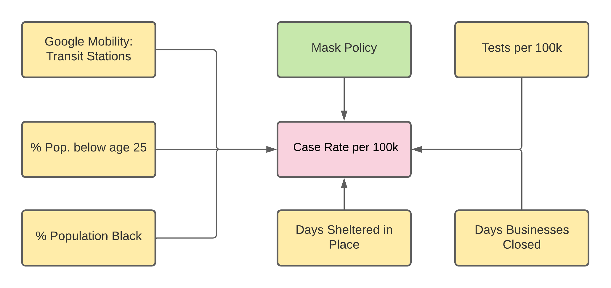

```{r setup, include=FALSE}
knitr::opts_chunk$set(echo = TRUE)
```

```{r library imports, include = FALSE}
library(tidyverse)
library(lmtest)
library(sandwich)
library(stargazer)
```

```{r data schema, include = FALSE}
schema <- cols(
  state = "c",
  cases_total = "i",
  cases_last_7_days = "i",
  case_rate = "n",
  case_rate_last_7_days = "n",
  deaths_total = "i",
  deaths_last_7_days = "i",
  death_rate = "n",
  death_rate_last_7_days = "n",
  tests_total = "i",
  tests_positive = col_factor(
    levels = c("0-5%", "6-10%", "11-20%"),
    ordered = TRUE
    ),
  test_rate = "i",
  white_cases = "i",
  white_pop = "i",
  black_cases = "i",
  black_pop = "i",
  hispanic_cases = "i",
  hispanic_pop = "i",
  other_cases = "i",
  other_pop = "i",
  white_deaths = "i",
  black_deaths = "i",
  hispanic_deaths = "i",
  other_deaths = "i",
  emerg_date = col_date(format = "%d/%m/%Y"),
  beg_bus_close_date = col_date(format = "%d/%m/%Y"),
  end_bus_close_date = col_date(format = "%d/%m/%Y"),
  bus_close_days = "i",
  beg_shelter_date = col_date(format = "%d/%m/%Y"),
  end_shelter_date = col_date(format = "%d/%m/%Y"),
  shelter_days = "i",
  mask_date = col_date(format = "%d/%m/%Y"),
  mask_use = "l",
  mask_legal = "l",
  beg_maskbus_date = col_date(format = "%d/%m/%Y"),
  end_maskbus_date = col_date(format = "%d/%m/%Y"),
  maskbus_use = "l",
  gov_party = col_factor(
    levels = c("R", "D"),
    ordered = FALSE
  ),
  pop_dens = "n",
  pop_total = "i",
  pre_cond_total = "i",
  serious_illness_pct = "n",
  all_cause_deaths_total = "i",
  homeless_total = "i",
  medicaid_pct = "i",
  life_expectancy = "n",
  unemployment_rate = "n",
  poverty_rate = "n",
  weekly_UI_max_amount = "i",
  household_income = "i",
  age_0_18 = "i",
  age_19_25 = "i",
  age_26_34 = "i",
  age_35_54 = "i",
  age_55_64 = "i",
  age_65 = "i",
  mob_RR = "i",
  mob_GP = "i",
  mob_PK = "i",
  mob_TS = "i",
  mob_WP = "i",
  mob_RS = "i"
)
```

```{r csv import, include = FALSE}
df <- read_delim(
  file = "clean_covid_19_LB_version.csv",
  delim = ";",
  col_names = TRUE,
  col_types = schema,
  na = ""
  )
```

# Causal Diagram




# Data Summary and Cleaning

The data used in the model is taken from the provided covid_19 dataset. The provided dataset is up-to-date as of October 30th, 2020. The final model uses eight variables that are either created from existing data or supplemented from online resources. Below are the adjustments made to variables that were either created or supplemented.

*Mask Use*

This binary/logical variable was created by assigning a 1 if the state had a mask mandate and 0 if it did not (based on the mask mandate date column). Some of the data from the mask mandate was missing and was manually research and populated.


*Percent Age Below 25*

This column was created by combining the 0-18 and 18-25 age groups. No other adjustments were made.

*Days in Shelter-in-Place*

The number of days each state was under the Shelter-in-Place mandate. This data was missing some data and supplemented by researching and populating the missing data. The column was creating by subtracting the end and start dates.

*Days Businesses Closed*

The number of days each state closed non-essential businesses. Similar to the days in SIP, missing data was populating through research of the state's specific mandates, then calculated by subtracting the end and start dates.

*Percentage of Pouplation: Black*

Observations that were marked as "< 0.01" were rounded up to 0.01 for a log transformation to be applied.

# Exploratory Data Analysis

*Talk about it being a policy and mandatory* Based on our causal model, mask use should lead to a decrease in the number of covid cases. The boxplot below suggests that this initial assumption at least holds to some degree.

```{r case rate vs mask use, warning=FALSE}
df %>%
  ggplot(aes(y = case_rate, x = mask_use)) +
  geom_boxplot() +
  labs(
    title = "Relationship between Mandatory Mask Use and Case Rate by state",
    x = "Mandatory Mask Use",
    y = "Case Rate per 100K"
  )
```

COVID-19 is a virus that spreads from person to person and the first stop gaps implemented were the closing of non-essential businesses and a Shelter-in-Place (SIP) mandate. A square-root transformation of the data better interprets the data as the correlation increases. *Diminishing returns and more linear relationship.*

```{r warning=FALSE}
df %>%
  ggplot(aes(y = case_rate, x = shelter_days)) +
  geom_point() +
  labs(
    title = "Relationship between Days Sheltered-in-Place and Case Rate by state",
    x = "Number of Days in SIP",
    y = "Case Rate per 100K"
  )

df %>%
  ggplot(aes(y = case_rate, x = sqrt(shelter_days))) +
  geom_point() +
  labs(
    title = "Relationship between sqrt(Days Sheltered-in-Place) and Case Rate by state",
    x = "sqrt Number of Days in SIP",
    y = "Case Rate per 100K"
  )
  
sip <- lm(case_rate ~ shelter_days, data = df)
sqrt_sip <- lm(case_rate ~ sqrt(shelter_days), data = df)
summary(sip)$r.squared
summary(sqrt_sip)$r.squared
```

Similarly, the number of days a non-essential business was closed would greatly reduce the number of human-human interactions. A log transformation of the number of businesses days closed also serves to increase the correlation slightly.

```{r warning=FALSE}
df %>%
  ggplot(aes(y = case_rate, x = bus_close_days)) +
  geom_point() +
  labs(
    title = "Relationship between Days Businesses Closed and Case Rate by state",
    x = "Number of Days Businesses Closed",
    y = "Case Rate per 100K"
  )
```


The number of positive cases a state has is strictly dependent on the number of tests administered. From the scatter plot below, we do see a positive relationship between the number of tests administered and the number of cases. Log and square-root transformations do not lead to a higher correlation therefore the variable is left as is.

```{r test_rate linear relationship, warning=FALSE}
df %>%
  ggplot(aes(y = case_rate, x = test_rate)) +
  geom_point() +
  labs(
    title = "Relationship between Test Rate and Case Rate by state",
    x = "Test Rate per 100K",
    y = "Case Rate per 100K"
  )
```

Next, we look at the correlation between case rate and age. From the covariance matrix below, age groups 0-18 and 65+ are not only the most extreme of the age groups, but covariances as well.

```{r variance-covariance matrix of case_rate vs. age variables, warning=FALSE}
var(df[ ,c(4, 51:56)], na.rm=TRUE)
```

```{r warning = FALSE}
df$age_below_25 = df$age_0_18 + df$age_19_25
df %>%
  ggplot(aes(y = case_rate, x = age_below_25)) +
  geom_point() +
  labs(
    title = "Relationship between Pct Below 25 and Case Rate by state",
    x = "% of Population Below 25",
    y = "Case Rate per 100K"
  )
```

We also examine the case rate vs ethnicity. The black population is much more correlated with case rate than any of the other ethnic groups. Being white is also negatively correlated with the case rate.

```{r variance-covariance matrix of case_rate vs. ethnicity, warning=FALSE}
var(df[ ,c(4,14,16,18,20)], na.rm=TRUE)
```

We more closely examine the correlation between black population percentage, the most highly correlated ethnicity variable, and case rate. From the graph below, we see that there is a slightly concaving arc as the proportion of black increases. ~~We apply a log transformation to see if the correlation increases and see that it does.~~

```{r warning = FALSE}
df$black_pop[df$black_pop == 0] = 0.01
df %>%
  ggplot(aes(y = case_rate, x = black_pop)) +
  geom_point() +
  labs(
    title = "Percentage Black Ethnicity in Total Population and Case Rate by state",
    x = "% of Population - Ethnicity: Black",
    y = "Case Rate per 100K"
  )

df %>%
  ggplot(aes(y = case_rate, x = log(black_pop))) +
  geom_point() +
  labs(
    title = "Log Percentage Black Ethnicity in Total Population and Case Rate by state",
    x = "Log(% of Population - Ethnicity: Black)",
    y = "Case Rate per 100K"
  )

blk_pop <- lm(case_rate ~ black_pop, data = df)
log_blk_pop <- lm(case_rate ~ log(black_pop), data = df)
summary(blk_pop)$r.squared
summary(log_blk_pop)$r.squared
```

*Add data from Google Human Mobility on time period of data*Included in the dataset is the Google Human Mobility metric regarding the change in activity of popular spots (retail, groceries, parks, etc.,). We find that the highest correlation of the mobility variables lies with the change in Transit Stations (mob_TS). Oddly enough, Wyoming is one of three states with a positive change in transit station use. Wyoming also has by far the largest change at 21% with South Dakota next at 3%. 

```{r variance-covariance matrix of case_rate vs. mobility variables, warning=FALSE}
var(df[ ,c(4, 57:62)], na.rm=TRUE)
```

```{r warning= FALSE}
df %>%
  ggplot(aes(y = case_rate, x = mob_TS)) +
  geom_point() +
  labs(
    title = "Relationship Between Human Mobility: Transit Stations and Case Rate by state",
    x = "Percentage Change in Human Mobility: Transit Stations",
    y = "Case Rate per 100K"
  )
```

# Model Building

## Model 1

### Model description

Our first regression model has **Covid-19 Case Rate per 100,000 habitants** as our outcome variable and two covariates: our variable of interest (**Mandatory Mask Use**) and **Test Rate per 100,000 habitants**.  

We have included **Test Rate** because we've seen before there is variability in the test rates among US states which could potentially affect the integrity of our outcome variable - e.g. states presenting lower case rate not because actual infection rate by covid is lower, but because test availability is lower. In order to mitigate such shortcomings we decided to have **Test Rate** as an independent variable since the very first version of our regression model.  

Our Model 1 has the format: 

case_rate = $\beta_0$ + $\beta_1$ * mask_use + $\beta_2$ * test_rate  

### Model summary

```{r model_1 summary, warning = FALSE}
model_1 <- lm(case_rate ~ mask_use + test_rate, data = df)
std_errors = sqrt(diag(vcovHC(model_1)))
stargazer(model_1, se = std_errors, type = "text", title = "Model 1 Summary")
```


### Overall model significance (F-test)

Under a significance level of 0.05, we can reject the null hypothesis ($H_0: \beta_1 = \beta_2 = 0$) in favor of our fuller model ($H_a: \beta_1 \ne 0$ and $\beta_2 \ne 0$), which now includes the covariates **mask_use** and **test_rate**. The F-Statistic = 7.416, and the p-value < 0.01. Our Model 1 has an adjusted R-squared of 0.204.  

### Coefficient significance (t-test)  

Under a significance level of 0.05, we can accept the alternative hypotheses $H_{a1}: \beta_1 \ne 0$ and $H_{a2}: \beta_2 \ne 0$, which means both of our covariates do explain part of the variability observed in the **case_rate**.  

Our estimate for $\beta_1$ (the coefficient of our variable of interest) is $\tilde \beta_1 = -990.5$, with a standard error of 307.0 and a p-value of 0.002.  

```{r model_1 coefficient test}
coeftest(model_1, vcovHC = vcovHC(model_1, type = "HC3"))
```

### Practical significance  

According to Model 1, states that have adopted mandatory mask use would expect to have -990.5 covid cases per 100,000 habitants. Given that the median of covid case rate among US states is of 2,633 per 100,000 habitants, with 1st Quartile = 2,040 and 3rd quartile = 3,516, the coefficient estimate has practical significance, with an effect size corresponding to a reduction of 37.6% of the median of the covid case rate among states.  

## Model 2

### Model description

Our second regression model has **Covid-19 Case Rate per 100,000 habitants** as our outcome variable and five covariates: our variable of interest (**Mandatory Mask Use**), **Test Rate per 100,000 habitants**, **Percentage of Population Below 25 Years Old**, **Log of Percentage of Black Ethnicity in Total Population**, and **Human Mobility Change in Transit Stations**.  

Model 2 represents our best understanding of the relationship among the variables, striking a balance between accuracy and parsimony. Our variable of interest continues to be **Mandatory Mask Use** and our measurement goal continues to be to assess the significance and practical impact of **Mandatory Mask Use** in the **Case Rate**. The other mediating variables we added to the model work like *controls* in order to allow us to better capture the significance and practical relevance of the **Mandatory Mask Use** in the decrease of **Case Rate**.    

Our Model 2 has the format: 

case_rate = $\beta_0$ + $\beta_1$ * mask_use + $\beta_2$ * test_rate + $\beta_3$ * age_below_25 + $\beta_4$ * log(black_pop) + $\beta_5$ * mob_TS  

### Model summary

```{r model_2 summary, warning = FALSE}
model_2 <- lm(case_rate ~ mask_use + test_rate + age_below_25 + log(black_pop) + mob_TS, data = df)
std_errors = list(
  sqrt(diag(vcovHC(model_1))),
  sqrt(diag(vcovHC(model_2)))
)
stargazer(model_1, model_2, se = std_errors, type = "text", title = "Model 2 Summary")
```


### Overall model significance (F-test)

Under a significance level of 0.05, we can reject the null hypothesis (**Model 1**) in favor of our fuller **Model 2**, which now includes the covariates **mask_use**, **test_rate**, **age_below_25**, **log(black_pop)**, and **mob_TS**. The F-Statistic = 16.258, and the p-value < 0.01. Our Model 2 has an adjusted R-squared of 0.593. Our residual standard error decreased from 1,013.8 to 725.3. **Model 2** is the most robus model we will build in the scope of this study.  

```{r model_2 F-test}
anova(model_1, model_2, test = "F")
```


### Coefficient significance (t-test)  

Under a significance level of 0.05, we can accept the alternative hypotheses: $H_{a1}: \beta_1 \ne 0$, $H_{a2}: \beta_2 \ne 0$, $H_{a3}: \beta_3 \ne 0$, and $H_{a4}: \beta_4 \ne 0$, which means 4 out of 5 of our covariates do explain part of the variability observed in the **case_rate**.  

Our estimate for $\beta_1$ (the coefficient of our variable of interest) is $\tilde \beta_1 = -961.4$, with a standard error of 240.0 and a p-value of 0.0002. It continues to be statistically significant and with an estimated value that changed little from **Model 1** (-990.5) to **Model 2** (-961.4).

```{r model_2 coefficient test}
coeftest(model_2, vcovHC = vcovHC(model_2, type = "HC3"))
```

### Practical significance  

According to Model 2, states that have adopted mandatory mask use would expect to have -961.4 covid cases per 100,000 habitants. Given that the median of covid case rate among US states is of 2,633 per 100,000 habitants, with 1st Quartile = 2,040 and 3rd quartile = 3,516, the coefficient estimate has practical significance, with an effect size corresponding to a reduction of 36.5% of the median of the covid case rate among states.

## Model 3

### Model description

Our third regression model has **Covid-19 Case Rate per 100,000 habitants** as our outcome variable and seven covariates: our variable of interest (**Mandatory Mask Use**), **Test Rate per 100,000 habitants**, **Percentage of Population Below 25 Years Old**, **Log of Percentage of Black Ethnicity in Total Population**, 
**Human Mobility Change in Transit Stations**, **Number of Days of Shelter in Place**, and **Number of Days of Non-Essential Businesses Closure**.  

**Model 3** includes the previous covariates, and other new 2 covariates, erring on the side of inclusion. A key purpose of **Model 3** is to demonstrate the robustness of the results of our measurement goal ($\tilde \beta_1$). New variables on **Model 3** represent other commom policies US states have adopted to combat the virus spread. They have some collinearity with mask use as it would be expected, since typically a state enact not a single, but a set of policies against covid-19.  

Despite the fact that **Model 3** loses some explanatory power due to the inclusion of the new variables, the result we would like to highlight is that our coeficient of interest ($\tilde \beta_1$) continued to be both statistically significant, and with an estimated value that has practical significance in terms of informing public policies in the combat to the virus.  

**Model 3** main role was to work as an *acid test* of the relevance of mandatory mask use in reducing the case rate of covid 19 among US states. And, in this sense, it helped us to confirm the robustness of our study results.  

Our Model 3 has the format: 

case_rate = $\beta_0$ + $\beta_1$ * mask_use + $\beta_2$ * test_rate + $\beta_3$ * age_below_25 + $\beta_4$ * log(black_pop) + $\beta_5$ * mob_TS + $\beta_6$ * shelter_days + $\beta_7$ * bus_close_days  

### Model summary

```{r model_3 summary, warning = FALSE}
model_3 <- lm(case_rate ~ mask_use + test_rate + age_below_25 + log(black_pop) + mob_TS + shelter_days + bus_close_days, data = df)
std_errors = list(
  sqrt(diag(vcovHC(model_1))),
  sqrt(diag(vcovHC(model_2))),
  sqrt(diag(vcovHC(model_3)))
)
stargazer(model_1, model_2, model_3, se = std_errors, type = "text", title = "Model 3 Summary")
```


### Overall model significance (F-test)

Under a significance level of 0.05, we can not reject the null hypothesis (**Model 2**) in favor of our fuller **Model 3**, which now includes the covariates **shelter_days** and **bus_close_days**. Our Residual Std. Error almost remained the same, even with the inclusion of two new variables. This demonstrates that there is collinearity between our new variables and the old ones. The inclusion of the new variables did not help to increase the explained variability of the outcome variable. The adjusted R-squared of **Model 3** is of 0.572.   

On the other hand, as it was asserted above, our focus of interest on **Model 3** is not on the overall roustness of the model (for that sake we have **Model 2**), but more on performing an *acid test* around the statistical and practical significance of our coeficient of interest ($\tilde \beta_1$).


### Coefficient significance (t-test)  

Under a significance level of 0.05, we can accept the alternative hypotheses: $H_{a1}: \beta_1 \ne 0$, $H_{a3}: \beta_3 \ne 0$, and $H_{a4}: \beta_4 \ne 0$, which means only 3 out of 7 of our covariates do explain part of the variability observed in the **case_rate**.  

Our estimate for $\beta_1$ (the coefficient of our variable of interest) is $\tilde \beta_1 = -940.7$, with a standard error of 284.9 and a p-value of 0.0006. It continues to be statistically significant and with an estimated value that changed little from **Model 2** (-961.4) to **Model 3** (-940.7).

```{r model_3 coefficient test}
coeftest(model_3, vcovHC = vcovHC(model_3, type = "HC3"))
```

### Practical significance  

According to Model 3, states that have adopted mandatory mask use would expect to have -940.7 covid cases per 100,000 habitants. Given that the median of covid case rate among US states is of 2,633 per 100,000 habitants, with 1st Quartile = 2,040 and 3rd quartile = 3,516, the coefficient estimate has practical significance, with an effect size corresponding to a reduction of 35.7% of the median of the covid case rate among states.
