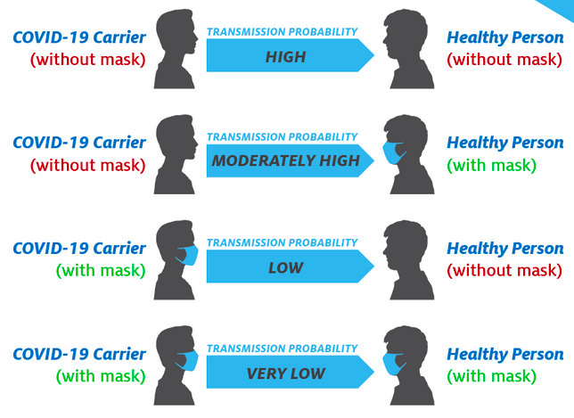
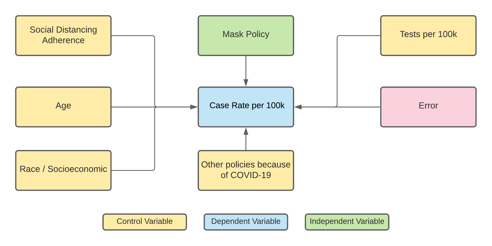
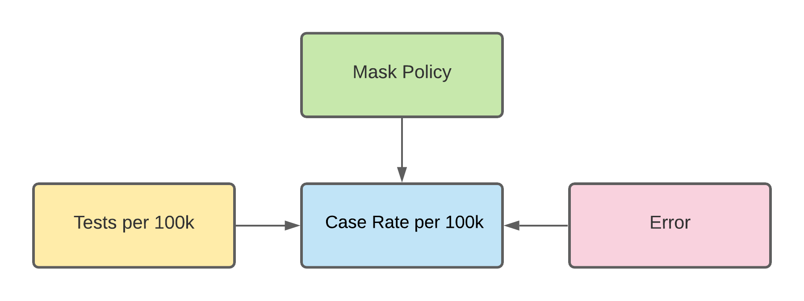
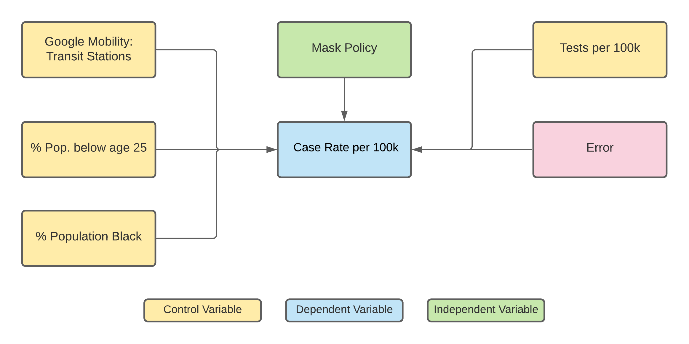
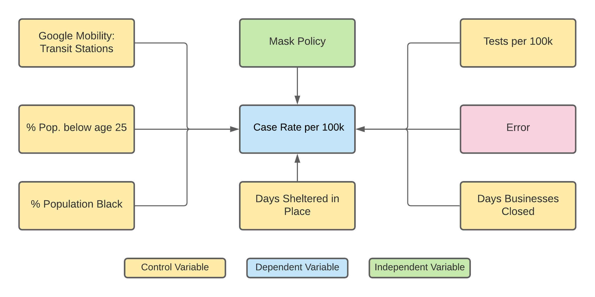

```{r setup, include=FALSE}
knitr::opts_chunk$set(echo = TRUE)
```

```{r library imports, include = FALSE}
library(tidyverse)
library(lmtest)
library(sandwich)
library(stargazer)
library(knitr)
library(GGally)
library(naniar)
library(gridExtra)
```

```{r data schema, include = FALSE}
schema <- cols(
  state = "c",
  cases_total = "i",
  cases_last_7_days = "i",
  case_rate = "n",
  case_rate_last_7_days = "n",
  deaths_total = "i",
  deaths_last_7_days = "i",
  death_rate = "n",
  death_rate_last_7_days = "n",
  tests_total = "i",
  tests_positive = col_factor(
    levels = c("0-5%", "6-10%", "11-20%"),
    ordered = TRUE
    ),
  test_rate = "i",
  white_cases = "i",
  white_pop = "i",
  black_cases = "i",
  black_pop = "i",
  hispanic_cases = "i",
  hispanic_pop = "i",
  other_cases = "i",
  other_pop = "i",
  white_deaths = "i",
  black_deaths = "i",
  hispanic_deaths = "i",
  other_deaths = "i",
  emerg_date = col_date(format = "%d/%m/%Y"),
  beg_bus_close_date = col_date(format = "%d/%m/%Y"),
  end_bus_close_date = col_date(format = "%d/%m/%Y"),
  bus_close_days = "i",
  beg_shelter_date = col_date(format = "%d/%m/%Y"),
  end_shelter_date = col_date(format = "%d/%m/%Y"),
  shelter_days = "i",
  mask_date = col_date(format = "%d/%m/%Y"),
  mask_use = "l",
  mask_legal = "l",
  beg_maskbus_date = col_date(format = "%d/%m/%Y"),
  end_maskbus_date = col_date(format = "%d/%m/%Y"),
  maskbus_use = "l",
  gov_party = col_factor(
    levels = c("R", "D"),
    ordered = FALSE
  ),
  pop_dens = "n",
  pop_total = "i",
  pre_cond_total = "i",
  serious_illness_pct = "n",
  all_cause_deaths_total = "i",
  homeless_total = "i",
  medicaid_pct = "i",
  life_expectancy = "n",
  unemployment_rate = "n",
  poverty_rate = "n",
  weekly_UI_max_amount = "i",
  household_income = "i",
  age_0_18 = "i",
  age_19_25 = "i",
  age_26_34 = "i",
  age_35_54 = "i",
  age_55_64 = "i",
  age_65 = "i",
  mob_RR = "i",
  mob_GP = "i",
  mob_PK = "i",
  mob_TS = "i",
  mob_WP = "i",
  mob_RS = "i"
)
```

```{r csv import, include = FALSE}
df <- read_delim(
  file = "covid_19_clean.csv",
  delim = ";",
  col_names = TRUE,
  col_types = schema,
  na = ""
  )
```

# Introduction

As of October 2020, more than 10 million Americans have been infected with the novel coronavirus (COVID-19) and more than 240,000 have perished. Currently, the United States leads the globe in the number of cases and the number of deaths.

A relatively simple way to control spread of this respiratory pathogen is with personal protective equipment, specifically face masks. When combined with social distancing face masks are an effective way of reducing spread within communities, workplaces and other public areas. In the absence of sophisticated testing, containment, and contact tracing techniques, the adoption of face masks in the United States has become an essential strategic component in the fight against COVID-19. While it is hard to quantify the exact efficacy, mask use not only reduces the chance of the wearer becoming infected, but also reduces the potential for transmission of virus-containing respiratory secretions to others (see diagram below).

On April 3, 2020, the Center for Disease Control (CDC) issued an official recommendation advising all persons to wear a cloth face mask or covering in public to help slow the spread of the coronavirus. Many states went on to enact a policy requiring people to wear face masks at all times in public settings, however some did not comply, despite mounting evidence in favor of such an order.

{width=85%}

Despite all of these recommendations, the use of face masks has become politicized and undermined by large swaths of the country’s population. Conflicting messages and spread of misinformation has resulted in a loss of credibility and trust in the CDC. As such, some states, counties, districts and individuals continue to ignore scientific advice by neglecting to enforce, or abide by mask use mandates. This may be one of the reasons behind the seemingly unimpeded rise of COVID-19 case rates in the US, when in comparison, other countries with stricter regulations (and better public compliance) have managed to control disease spread. 

Accordingly, as a team we have decided to leverage the provided dataset in order to public health guidance and answer the following question:

**Does the implementation of a mandatory face mask policy for all individuals aid in reducing the case rate of COVID-19 in the United States?**

We hypothesize that a face mask mandate does indeed have a measurable & causal impact on containing the spread of COVID-19, even when taking into account age and socioeconomic demographics, social distancing adherence, and other related policies. This is visually represented in the causal diagram below. Our measurement goal is to assess the statistical significance and practical significance of statewide mandatory face mask usage policies in reducing the COVID-19 case rate. We will methodically include incremental covariates from the aforementioned categories in our regression models, in an effort to isolate the portion of case rate variability actually explained by implementation of a mandatory face mask policies. These other covariates, while important, will help absorb some of the “noise” not specifically associated with the implementation of a face mask policy.



\newpage

## Data

The COVID-19 dataset is an aggregation of data from a variety of sources and updated at various dates. The final dataset with its most recent update is shown in the table below:

| Data                                | Source                           | Last Updated |
|-------------------------------------|----------------------------------|--------------|
| COVID-19 Cases, Deaths, and Testing | Center for Disease Control (CDC) | 10/30/2020   |
| COVID-19 Cases by Race/Ethnicity    | Kaiser Family Foundation (KFF)   | 10/25/2020   |
| COVID-19 Deaths by Race/Ethnicity   | KFF                              | 10/25/2020   |
| Policies                            | Raifman J, et. al.               | 10/26/2020   |
| State Characteristics               | CDC, KFF, and Raifman            | N/A          |
| Demographics                        | KFF                              | 2018         |
| Human Mobility                      | Google                           | 10/23/2020   |

The Google Human mobility data is updated daily, and includes information on the amount of time spent at various public locations compared to baseline data. Below are the adjustments made to variables that were either created or supplemented. 

There are a total of 6 data types in the dataset: character, numeric, integer, factor, dates, and logical. Any variable with “date” in the name is read in as a date. Logical variables include 'mask_use,' 'mask_legal,' and 'maskbus_use.' Variables read in as factors include 'gov_party,' and 'tests_positive.' The only character variable is the state name. Finally, all other variables are read in as either numeric or an integer. All numeric and integer values are real and nonnegative.

Some of the data was missing from the initial table and was manually populated using an external website$^1$ so we could calculate the number of days of shelter in place. Although some of the states had not yet ended their shelter in place policies, we chose 10/30/2020 as the absolute cutoff for our analysis. The table on the next page shows the data populated manually (empty cells were left as is):

| State       | beg_shelter_date | end_shelter_date |
|-------------|------------------|------------------|
| California  |                  | 10/30/2020       |
| Connecticut | 3/23/2020        |                  |
| New Mexico  |                  | 10/30/2020       |
| Oklahoma    | 3/30/2020        |                  |
| Texas       | 4/2/2020         |                  |


### Variable Operationalization

**Mask Use**

This binary/logical variable was created by assigning a 1 if the state had a mask mandate, and 0 if it did not (based on the mask mandate for all individuals date column). 

**Percent Age Below 25**

This column was created by combining the 0-18 and 18-25 age groups (rationale discussed in Model 2 section). No other adjustments were made.

**Days in Shelter-in-Place**

The number of days each state was under the Shelter-in-Place (SIP) mandate. There was some missing data, which was supplemented from external sources (outlined above). The column was created by subtracting the end and start dates.

**Days Businesses Closed**

The number of days each state closed non-essential businesses. No other adjustments were made.

**Percentage of Population: Black**

We interpreted observations of "< 0.01" to mean that the percentage of the population was negligible for the practical purposes of our analysis. We subsequently rounded these down to 0 so they could be treated as numeric.  

## Model 1

### Objective

Model 1 is the simplest model. Its aimed at measuring the strength of the relationship between the presence of a mandatory mask use policy and the COVID-19 case rate per 100,000 in a state. It has no other covariates, with the exception of test rate, which we include as a way to control for the impact that different test availabilities might have on the case rate by state (rationalized and discussed further below). 

```{r initialize model 1}
df_mod1 <- df %>%
  select(case_rate, mask_use, test_rate)
```

### Exploratory Data Analysis

First, we assessed the data provided for the variables of interest. This analysis specifically pertained to detection of spurious values and missing data. We discuss the distribution of the data in the following dedicated sections. 

#### Case Rate

For the main outcome variable, we can see that there are no missing values in the columns of interest:

```{r fig.height = 3, fig.width = 5}
vis_miss(df %>% select(case_rate)) + theme(axis.text.x = element_text(angle = 0, hjust = 0.5))
```

We can then analyze the summary statistics for the case rate from which we can see there are no negative or observably spurious values: 
```{r summary stats model 1}
summary(df_mod1$case_rate)
```

Together with the summary statistics presented in the previous section, we can further isolate the case rate variable and visualize its distribution:

```{r warning=FALSE, fig.height = 4, message=FALSE}
df %>%
  ggplot(aes(x = case_rate)) +
  geom_histogram(bins = 50) +
  labs(title = "Histogram of Case Rate per 100,000",
       y = "Count",
       x = "Case Rate per 100,000")
```

From the above histogram, we can see that the case rate is approximately normally distributed, though there are some states that are obvious outliers, with very high and very low case rates per 100,000.

Next, we can visually assess the case rate across the 50 states by plotting a bar graph:

```{r include=FALSE}
get_quantiles <- function(column) {
  quantiles <- data.frame(
    name = factor(c("3rd Quartile", "Mean", "1st Quartile"), levels = c("3rd Quartile", "Mean", "1st Quartile")),
    value = c(quantile(column, 0.75), mean(column), quantile(column, 0.25))
  )
  
  return(quantiles)
}
```

```{r warning=FALSE, fig.height = 4, message=FALSE}
quantiles <- get_quantiles(df$case_rate)

df %>%
  ggplot(aes(x = state, y = case_rate)) +
  geom_bar(stat="identity") +
  theme(axis.text.x = element_text(angle = 90, vjust = 0.5, hjust=1)) +
  geom_hline(data = quantiles, aes(yintercept = value, color = name)) +
  labs(title = "Case Rate Across 50 States",
       y = "Case Rate/100,000",
       x = "State",
       color = "Legend")
```

We can see that there are a substantial number of states with case rates below the mean (2,749), and a few below the 1st (2,040) and 3rd (3,516) quartiles.

We now look at the correlation between case rate and our causal variables of interest. 

#### Case Rate vs. Mandatory Mask Policy

Before conducting a comparison between the dependent and main independent variable, we must ensure that there are no spurious or missing data in the mandatory mask policy category. As we can see below, there is no missing data for this variable:

```{r fig.height = 3, fig.width = 5}
vis_miss(df %>% select(mask_use)) + theme(axis.text.x = element_text(angle = 0, hjust = 0.5))
```

As the mask use policy variable is binary, we only need to ensure that there are 51 observations (51 as the District of Columbia is included in the dataset):

```{r}
summary(df_mod1$mask_use)
```

We can also see that 1/3 of all the states surveyed did not have a mask use policy in place by October 30th, 2020.

Based on our hypothesis, implementation of a statewide mask-use policy should lead to a decrease in the number of COVID cases by preventing their spread. From the box plot comparison below we can visually discern an apparent positive correlation between mask use policy categories and case rates. This broadly falls in line with our hypothesis, as we can see that the mean case rate in the 'True' (i.e. enforced mask policy) category (2,473/100,000) is substantially lower than that of the 'False' (i.e. no enforced mask policy) category (3,303/100,000):

```{r warning=FALSE, message=FALSE, fig.height = 4}
df_mod1 %>%
  ggplot(aes(y = case_rate, x = mask_use)) +
  geom_boxplot() +
  labs(
    title = "Mandatory Mask Use vs Case Rate by State",
    x = "Mandatory Mask Use",
    y = "Case Rate per 100,000") 
```

\newpage

#### Case Rate vs. Test Rate

First, we assess for any potential missing data for the test rate variable. As we can see from below, there is none:

```{r fig.height = 3, fig.width = 5}
vis_miss(df %>% select(test_rate)) + theme(axis.text.x = element_text(angle = 0, hjust = 0.5))
```

Next, we ensure there are no spurious values by calculating summary statistics: 

```{r}
summary(df_mod1$test_rate)
```

Together with the summary statistics presented previously, we can visualize the distribution of test rates using a histogram:

```{r warning=FALSE, fig.height = 4, message=FALSE}
df %>%
  ggplot(aes(x = test_rate)) +
  geom_histogram(bins = 50) +
  labs(title = "Histogram of Test Rate per 100,000",
       y = "Count",
       x = "Test Rate per 100,000")
```

From the above histogram, we can see that there is a definite positive skew of the data, meaning that the "worst performing" states had test rates were approximately 1/3 of the "top performing" states in terms of tests administered per 100,000 of population. This is an interesting observation, and warrants a comparison between the test rates and case rates to see if there is any potential relationship, which we will next perform.

An important control variable in our causal models is the test rate per 100,000 of the population: We hypothesize that the more tests are performed, the higher the overall case rate. Though this seems like an obvious assumption, the issue is particularly complex, and the relationship not as straightforward as initially apparent$^2$. Consequently, we believe that including the test rate per 100,000 is potentially an important control variable in our model:    

```{r warning=FALSE, fig.height = 4, message=FALSE}
df_mod1 %>%
  ggplot(aes(y = case_rate, x = test_rate)) +
  geom_point() +
  geom_smooth(method = "lm", level = 0) + 
  labs(
    title = "Case Rate vs Test Rate by State",
    x = "Test Rate per 100,000",
    y = "Case Rate per 100,000")
```

The above diagram visualizes the relationship between test and case rates per 100,000. It confirms the more "simple"" hypothesis of a positive relationship between case rate and number of tests. This relationship is slight, however (as evidenced by the slope of the line). Due to the prior reasoning and demonstrable positive relationship between the variables, we subsequently choose to include it in all subsequent models. 

### Casual Diagram for Model 1

Our initial assumptions have been validated by a cursory analysis and we are confident that the causal diagram below holds true. Colored in blue at the center is the main dependent variable, case rate per 100,000. In green, pointing to the case rate (signifying a causal effect on the dependent variable) is the main independent variable, mask use policy. In yellow is the test rate per 100,000 as the first control variable. Finally, in red is the error term that contains all other variables.



### Model specification

The first regression model uses **COVID-19 Case Rate per 100,000** as the outcome variable and two covariates: the variable of interest (**Mandatory Mask Use**) and **Test Rate per 100,000**.  

**Test Rate** has been included because there is an evident positive relationship between test rates and case rates. Subsequently, it should be included as a control variable in our subsequent models in order to prevent potential misattribution of effects to other included variables. 
  
Model 1 is subsequently defined as: 

$$
\begin{aligned}
\mathrm{case\ rate\ per\ 100,000\ pop.} = \beta_0 + \beta_1(\mathrm{mandatory\ mask\ use\ policy}) + \beta_2(\mathrm{test\ rate\ per\ 100,000\ pop.})
\end{aligned}
$$

### Model summary

```{r model_1 summary, results = "asis", warning = FALSE}
model_1 <- lm(case_rate ~ mask_use + test_rate, data = df)
std_errors = sqrt(diag(vcovHC(model_1)))
stargazer(model_1, se = std_errors, title = "Model 1 Summary", header = FALSE)
```

\newpage

### Overall model significance (F-test)

This compares the null hypothesis, where $H_0: \beta_1 = \beta_2 = 0$, against an alternative hypothesis where $H_a: \beta_1 \ne 0$ or $\beta_2 \ne 0$ at a significance level of 0.05: 

```{r model_1 F-test}
model_0 <- lm(case_rate ~ 1, data = df)
anova(model_0, model_1, test = "F")
```

The F-Statistic is 7.416, and the p-value is < 0.01, with an adjusted R-squared of 0.204. From the F-test, we can reject the null hypothesis ($H_0$) in favor of the more complete model ($H_1$) which now includes the covariates **Mandatory Mask Use** and **Test Rate per 100,000**. This is the base model we will henceforth build upon.

### Coefficient significance (t-test)

In order to assess the performance of the model, we can look at the other model coefficients:

```{r model_1 coefficient test}
coeftest(model_1, vcovHC)
```

Under a significance level of 0.05, we can accept the alternative hypotheses $H_{a}: \beta_1 \ne 0$, which means **Mandatory Mask Use** explains at least a part of the variability observed in the **COVID-19 Case Rate per 100,000**.  

On the other hand, for **Test Rate per 100,000** we failed to reject the null hypothesis that $H_{0}: \beta_2 = 0$. It seems this variable is not absorbing a significant part of the variability observed in the outcome, **COVID-19 Case Rate per 100,000**.

Our estimate for $\beta_1$ (the coefficient of our variable of interest) is $\tilde \beta_1 \approx-990.5$, with a standard error of ~324.8 and a p-value of 0.004.  

### Practical significance  

According to Model 1, enforcement of mask use policies would be expected to reduce the case rate by ~990.5 cases/100,000 or by ~1%, *ceteris paribus*. Given that the median COVID-19 case rate among US states is 2,633 per 100,000, the coefficient estimate has practical significance, with an effect size corresponding to a reduction of 37.6% of the median case rate among states.  

\newpage

## Model 2

### Objective

Model 2 is designed to be the optimal model, which strikes a balance between accuracy and parsimony. It is intended to reflect the best understanding of relationships between key variables. It includes the same covariates used in Model 1, in addition to new covariates related to structural demographics and behavioral differences between states that might partly correlate with the variability observed in the case rate. 

It is difficult to make *a priori* assumptions regarding the variables we will utilize for Model 2. We hope to select one causal variable from each of the three broader categories that we believe align with our hypotheses regarding the factors influencing COVID-19 case rates. The broad categories include:

- Age demographics
- Socioeconomic demographics
- Social distancing adherence

Model selection will be based upon our EDA. For each one of these categories, we will look for variables that correlate more strongly with case rate, but without a high degree of collinearity with the other variables already included in the model.

```{r initialize model 2}
df_race <- df %>%
  select(state, case_rate, white_pop, black_pop, hispanic_pop, other_pop)
df_socio <- df %>%
  select(state, case_rate, homeless_total, poverty_rate, household_income, 
         life_expectancy, unemployment_rate, black_pop)
df_dist <- df %>%
  select(state, case_rate, `mob_R&R`, `mob_G&P`, mob_P, mob_TS, mob_WP, mob_RES)
df_age <- df %>%
  select(state, case_rate, age_0_18, age_19_25, age_26_34, age_35_54, age_55_64, age_65)
df_socio$life_expectancy <- df_socio$life_expectancy/10
```

### Exploratory Data Anaysis

**Age Demographics**

In order to select the most appropriate age groups (i.e. % of population of a particular age group in a state) to include in our model, we must conduct a detailed exploratory analysis of the individual independent variables, their relationship with the dependent variable and their fellow categories.

First we ensure that there is no missing data in any of the age groups. The below figure confirms that there is no missing data:

```{r fig.height = 3, fig.width = 5}
df_age %>% 
  vis_miss() + 
  theme(axis.text.x = element_text(angle = 90))
```

Next we ensure there is no spurious data contained in any of the age categories. From below, we can see that all the categories look to be well behaved in terms of the data they contain:

```{r summary age}
df_age %>%
  select(where(is.numeric)) %>%
  summary()
```

Now that we have ensured the integrity of our data, we examine how each particular age group is related to the dependent variable and to each of the other age variables:

```{r warning=FALSE, fig.height = 6, message=FALSE}
ggpairs(df_age[,-1])
```

From the above scatterplot matrix we can see that the age groups that have highest correlation with our dependent variable (case rate) are below 25 (r = ~0.6) and 0-18 (r = ~0.5). These might both be valuable causal factors in terms of case rate and could be combined to enhance the model, while preventing the collinearity occuring if the two variables were added separately (as they also strongly correlate with each other, r = ~0.5). We can subsequently look at our newly transformed "<25" category in more detail:

First we can plot a scatterplot to see what percentage of the population <25 exists in each state:

```{r warning=FALSE, fig.height = 4, message=FALSE}
df_age$age_below_25 = df$age_0_18 + df$age_19_25
df$age_below_25 = df$age_0_18 + df$age_19_25
quantiles <- get_quantiles(df$age_below_25)

df %>%
  ggplot(aes(x = state, y = age_below_25)) +
  geom_point(stat="identity") +
  ylim(0, 45) +
  labs(title = "% of Population Under 25 Years Old Across States",
       y = "%",
       x = "State",
       color = "Legend") +
  theme(axis.text.x = element_text(angle = 90, vjust = 0.5, hjust=1)) +
  geom_hline(data = quantiles, aes(yintercept = value, color = name))
```

As we can see from the above, all of the states have similar proportions of their population < 25, with the interquartile distance being relatively small, indicating a generally uniform national age distribution. 

We can subsequently move on to the comparison between the new 'age <25' category and the dependent variable:

```{r warning=FALSE, fig.height = 4, message=FALSE}
df_age %>%
  select(case_rate, age_below_25) %>%
  ggplot(aes(y = case_rate, x = age_below_25)) + 
  geom_point() +
  geom_smooth(method = "lm", level = 0) + 
  labs(
    title = "Case Rate vs Percent Age Below 25",
    x = "Percent Age Below 25",
    y = "Case Rate per 100,000")
```

As we can see from the above, there is a definite positive relationship between the percent of people in the <25 age category and the case rate per 100,000. As such, it is unlikely that further transformation to this variable is required, and we can utilize it as a representation of an age demographic factor in our causal model moving forward. 

#### Case Rate vs. Socioeconomic Demographics

It is well known and documented that COVID-19 has affected different ethnic groups differently, with figures demonstrating that case rates and death rates are higher among certain minority groups. This may be partially attributable to genetic factors. It may also be related to socioeconomic factors, such as poverty, inability to work from home, education, among many other reasons, which are also related to race. 

Again, we begin by confirming the data has been recorded properly and that there are no missing values:

```{r fig.height = 3, fig.width = 5}
df_race[,c(-1,-2)] %>% 
  vis_miss() + 
  theme(axis.text.x = element_text(angle = 0, hjust = 0.5))
```

Next we ensure there is no spurious data contained in any of the race categories. From below, we can see that all the categories look to be well behaved in terms of the data they contain:

```{r summary race}
df_race[,c(-1,-2)] %>%
  select(where(is.numeric)) %>%
  summary()
```

Now that we have ensured the integrity of our data, we examine how the state percentage of particular race category might be related to the dependent variable and to each of the other race groups:

```{r warning=FALSE, fig.height = 6, message=FALSE}
ggpairs(df_race[,-1])
```

As we can see from the above scatterplot matrix, in general there are generally weak relationships between case rate per 100,000 and percentage of the particular racial group per state, in fact the majority show a negative relationship. Nevertheless, we can observe that the strongest absolute value for relationship is positive, and demonstrated by the percentage of black population per state, correlating with case rate with an r of ~0.3. We can visualize the distribution of black people by percentage of state population using a bar graph:

```{r warning=FALSE, fig.height = 4, message=FALSE}
quantiles <- get_quantiles(df$black_pop)
df %>%
  ggplot(aes(x = state, y = black_pop)) +
  geom_bar(stat="identity") +
  labs(title = "% Black Population",
       y = "%",
       x = "State",
       color = "Legend") +
  theme(axis.text.x = element_text(angle = 90, vjust = 0.5, hjust=1)) +
  geom_hline(data = quantiles, aes(yintercept = value, color = name))
```

As we can observe from the above graph, there is a wide variance in the percentage of black population by state. Nevertheless, as linear regression does not require normality of data as an assumption, we can continue to utilize this variable.  

As mentioned in the introduction, race may potentially act as a proxy for socioeconomic factors such as poverty, access to healthcare and education, among others$^3$. Consequently, if there is potential collinearity observed between dedicated socioeconomic categories in the dataset and a particular racial category, including them both as separate dependent variables might cause problems with the model. As such, we have included the percentage of black population per state in the following scatterplot analysis of the relationship between various socioeconomic factors and case rate. Our reasoning for this is because we already know from previously that the black ethnicity variable is strongly correlated with case rate, and we can study this relationship further. 

First we assess for missing data in the socioeconomic categories we will be assessing:

```{r fig.height = 3, fig.width = 5}
df_socio[,c(-1,-2)] %>% 
  vis_miss() + 
  theme(axis.text.x = element_text(angle = 90))
```

Next we do an analysis to ensure there are no spurious values in the data for any of the variables:

```{r summary stats race}
df_socio[,c(-1,-2)] %>%
  select(where(is.numeric)) %>%
  summary()
```

We have already identified a few missing values in the household income and life expectancy column. Nevertheless, the rest of the variables look to be well behaved and contain summary values concordant with what one would expect for these data types. 

Next we can create the scatterplot matrix for the socioeconomic variables of interest (+ percentage of blacks):

```{r warning=FALSE, fig.height = 6, message=FALSE}
ggpairs(df_socio[,-1])
```

From the pairs plot above, we see that poverty rate and household income have the highest absolute correlation with case rate per 100,000. They are comparable to the correlation of percentage of black population variable seen above. Additionally, the black population variable has high collinearity with household income, poverty rate, life expectancy, and unemployment rate. Because of this, the percent black population variable may act as a proxy that can control for many of these factors, while also being representative of racial factors.

We explore the bivariate relationship between case rate and percentage of black population below: 

```{r warning=FALSE, fig.height = 4, message=FALSE}
df_race %>%
  ggplot(aes(y = case_rate, x = black_pop)) +
  geom_point() +
  geom_smooth(method = "lm", level = 0) +
  labs(
    title = "Case Rate vs % Black by state",
    x = "% Black",
    y = "Case Rate per 100,000")
```

The untransformed relationship shows a rather weak positive correlation with case rate. Moreover, the points seem to become further spaced as the value of X increases. Disregarding the straight regression line, we can observe a somewhat non-linear relationship between the data points. As such, this variable could benefit from transformation. Due to some states having effectively 0% black population (due to rounding down of the "<0.01" category), a log transformation would not apply. To avoid this, each value is increased by 1 prior to the log transform:

```{r warning=FALSE, fig.height = 4, message=FALSE}
df_race %>%
  ggplot(aes(y = case_rate, x = log1p(black_pop))) +
  geom_point() +
  geom_smooth(method = "lm", level = 0) + 
  labs(
    title = "Case Rate vs log plus 1 (% Black by state)",
    x = "log plus 1(% Black)",
    y = "Case Rate per 100,000")
```

The graph above demonstrates that a transformation distributes the points more evenly along the X axis, making the potential linear relationship more discernable.

#### Case Rate vs. Social Distancing Adherence

The Google Human mobility data includes information on the amount of time spent at various public locations compared to Google's baseline data. The values are recorded as percentage changes with possible values ranging from -100 to 100. In general this data is a proxy for adherence to social distancing regulations. We would expect to see reductions in mobility upon enforcement of shelter-in-place, work-from-home or quarantine orders. Moreover, we would expect to see drastic reductions at transit stations (e.g. busy commuter hubs). As social distancing measures are designed to reduce the transmission of COVID-19, we would expect there to be a positive relationship between mobility and case rate, i.e. reductions in mobility are linked to lower case rates and vice versa. Nevertheless, there are several different social distancing metrics to choose from, which we deal with in this section.

We can see that there are no missing data points in this category:

```{r fig.height = 3, fig.width = 5}
df_dist[,c(-1,-2)] %>% 
  vis_miss() + 
  theme(axis.text.x = element_text(angle = 90))
```

A look at the summary statistics of the values fail to show any significant errors in values:

```{r}
df_dist %>%
  select(where(is.numeric)) %>%
  summary()
```

Below is the pairs plot for the mobility data and case rate per 100,000:

```{r warning=FALSE, fig.height = 6, message=FALSE}
ggpairs(df_dist[,-1])
```

All the mobility data are highly collinear with one another, so for the model, we will select "mob_TS" (i.e. change in mobility at transit stations) as it has the highest correlation with case rate, with an r of 0.237. We can visualize the changes in mobility by State to see if there are any interesting trends worth exploring:

```{r warning=FALSE, fig.height = 4, message=FALSE}
quantiles <- get_quantiles(df$mob_TS)
df %>%
  ggplot(aes(x = state, y = mob_TS)) +
  geom_point(stat="identity") +
  labs(title = "% Change in Mobility",
       y = "% Change",
       x = "State",
       color = "Legend") +
  theme(axis.text.x = element_text(angle = 90, vjust = 0.5, hjust=1)) +
  geom_hline(data = quantiles, aes(yintercept = value, color = name))
```

As expected, the majority of states have witnessed a decline in mobility at their respective transit centers. In general, the data is congruent with expectations, for example the District of Columbia has seen the largest decrease in transit station mobility at >70%. Interestingly, there are 3 states that have seen increases, with Wyoming seeing a substantial increase in transit station mobility. Nevertheless, these trends are unlikely to affect our further analysis using the variable in our model.

The figure below shows the bivariate relationship between case rate variable and the change in mobility at transit stations:

```{r warning=FALSE, fig.height = 4, message=FALSE}
df_dist %>%
  ggplot(aes(y = case_rate, x = mob_TS)) +
  geom_point() +
  geom_smooth(method = "lm", level = 0) +
  labs(
    title = "Relationship Between Mobility: Transit Stations and Case Rate by State",
    x = "Percentage Change in Mobility: Transit Stations",
    y = "Case Rate per 100,000")
```

From the above figure, we can discern a clear positive relationship between the X and Y variables. As the points are approximately evenly distributed within the axes, there is no clear and explainable transformation that can be applied. The variable will be left as is for the second model.

### Casual Diagram for Model 2

The causal diagram for Model 2 further resembles the diagram from the introduction section. We have now explored the effect of age, race, socioeconomic factors, and mobility as it pertains to policies for mask use and the COVID-19 case rate per 100,000. For the age category, percent population <25 had strongest correlation with case rate. The percentage of black people per state served as the strongest proxy to control for socioeconomic and racial characteristics. Using Google's mobility data as a proxy for adherence to social distancing measures, we found that the percentage change in traffic through transit stations had strongest correlation with case rate per 100,000.



### Model specification

The second regression model has **COVID-19 Case Rate per 100,000** as the outcome variable and 5 covariates: The variable of interest (**Mandatory Mask Use**), and 4 control variables: **Test Rate per 100,000**, **Percentage of Population Below 25 Years Old**, **Log of Percentage of Black Ethnicity in Total Population + 1**, and **Human Mobility Change in Transit Stations**.  

The variable of interest continues to be **Mandatory Mask Use** and the primary measurement goal remains to assess the significance and practical impact of **Mandatory Mask Use** on the **COVID-19 Case Rate per 100,000**. We predict this model (with more control variables) to be better at capturing the actual significance and practical relevance of the **Mandatory Mask Use** on **Case Rate**.    

Model 2 has the format: 
$$
\begin{aligned}
\mathrm{case\ rate\ per\ 100,000\ pop.} = \beta_0 + \beta_1(\mathrm{mandatory\ mask\ use\ policy}) +
\beta_2(\mathrm{test\ rate\ per\ 100,000\ pop.}) + \\ \beta_3(\mathrm{\% \ pop.\ <25}) +  \beta_4(\mathrm{\ln (\%\ black\ pop. + 1)}) + \beta_5(\mathrm{mobility\ \Delta\ transit\ stations})
\end{aligned}
$$

\newpage

### Model Summary

```{r model_2 summary, results = "asis", warning = FALSE}
model_2 <- lm(case_rate ~ mask_use + test_rate + age_below_25 + 
                log(black_pop + 1) + mob_TS, data = df)
std_errors = list(
  sqrt(diag(vcovHC(model_1))),
  sqrt(diag(vcovHC(model_2))))
stargazer(model_1, model_2, se = std_errors, title = "Model 2 Summary", header = FALSE)
```

\newpage

### Overall model significance (F-test)

This compares the null hypothesis, where $H_0:$ **Model 1**, against an alternative hypothesis where $H_a:$ **Model 2** at a significance level of 0.05: 

```{r model_2 F-test}
anova(model_1, model_2, test = "F")
```

From this F-test, we can reject the null hypothesis (**Model 1**) in favor of our optimized **Model 2**, which now includes the covariates **Mandatory Mask Use**, **Test Rate per 100,000**, **% of Age <25**, **ln(% of Black Population + 1)**, and **% Mobility Change at Mobile Transit Stations**. The F-Statistic is 19.733, and the p-value < 0.01. Model 2 has an adjusted R-squared of 0.633.

### Coefficient significance (t-test)  

Under a significance level of 0.05, we can accept all the alternative hypotheses: $H_{a1}: \beta_1 \ne 0$, $H_{a2}: \beta_2 \ne 0$, $H_{a3}: \beta_3 \ne 0$, $H_{a4}: \beta_4 \ne 0$, and $\beta_5 \ne 0$. This means all 5 covariates assist in explaining a part of the variability observed in the **COVID-19 Case Rate per 100,000**.  

Our estimate for $\beta_1$ (the coefficient of our variable of interest) is $\tilde \beta_1 = -919.3$, with a standard error of 227.0 and a p-value of 0.0002. It continues to be statistically significant, and with an estimated value that did not change a lot from **Model 1** (-990.5) to **Model 2** (-919.2).

```{r model_2 coefficient test}
coeftest(model_2, vcovHC)
```

### Practical significance  

According to Model 2, suggests that enforcing a mandatory mask use policy would expect to reduce the COVID-19 positive case rate by ~919.2 cases per 100,000, with all other variables being held constant. Given that the median case rate across states is 2,633 per 100,000, the coefficient estimate has practical significance, with an effect size corresponding to a reduction of 34.9% of the median state case rate value.

## Model 3

### Objective

Model 3 includes all the previous covariates, and several other covariates, erring on the side of inclusion. A key purpose of this model is to demonstrate the robustness of our coefficient for mandatory mask use. We do not expect our model performance to increase significantly compared to Model 2.  

Subsequently, we will include other COVID-related measures adopted by states, which might also contribute towards variability of the dependent variable i.e. case rate per 100,000. Moreover, some of these variables may be collinear with our primary independent variable, statewide mandated mask use. This may potentially reduce the overall explanatory performance of our model, however. We want to verify that even under harsh conditions our coefficient for mandatory mask use remains statistically significant, and with a practical significance close to that of Model 2.

Model 3 therefore acts as an *acid test* to further validate Model 2 as the most optimized model.

```{r model 3 variable initialization}
df_mod3 <- df %>%
  select(state, case_rate, bus_close_days, shelter_days, mask_legal, maskbus_use)
```

#### Case Rate vs. Other COVID Related Policies

The variables selected in the exploratory phase of Model 3 regard other COVID-19 specific policies. We are using the number of days a business had to close, the duration of shelter-in-place, and whether there was legal enforcement to wear a mask.

From the summary statistics, we can see that the numbers mostly make sense. There are no negative values, and the max number of days in shelter-in-place (since October 30th) would have the shelter-in-place start from March 19th, 2020, a full 8 days after the WHO declared COVID-19 a pandemic.

First we can assess the integrity of our data, and confirm that there are no missing datapoints:

```{r fig.height = 3, fig.width = 5}
df_mod3[,c(-1,-2)] %>% 
  vis_miss() + 
  theme(axis.text.x = element_text(angle = 90))
```

Next we can ensure that the data are well behaved and do not contain any spurious values:

```{r summary stats - other covid policies}
df_mod3[,c(-1,-2)] %>%
  select(where(is.numeric)) %>%
  summary()
```

The continues variables corresponding to business close days and days of shelter in place seem to contain data concordant with what we would expect them to contain. Next, we can assess the column containing data pertaining to enforcement of mask wear, which we can see contains 51 values, with no missing data:

```{r}
summary(df_mod3$mask_legal)
```

We can utilize a scatterplot matrix to visualize the relationships between the case rate and other COVID-19 related policies: 

```{r warning=FALSE, fig.height = 6, message=FALSE}
ggpairs(df_mod3[,-1], upper = list(combo = "points"))
```

As we cannot calculate a Pearson r correlation score to quantify the relationship between a categorical variable and a continuous variable, instead we can conduct a point biserial test to assess for the relationship between the legal enforcement of mask use and case rate variables:

```{r warning=FALSE, fig.height = 4, message=FALSE}
df_mod3 <- df_mod3 %>% 
  mutate(binary_legal = as.integer(as.logical(mask_legal)))
cor.test(df_mod3$case_rate, df_mod3$binary_legal)
```

As we can see from the above scatterplot matrix, variables pertaining to business closure days and shelter days are both negatively correlated with case rate, with Pearson r of ~-0.2 and ~-0.3, respectively. They are also both collinear, with a correlation of r = ~0.4. Due to the fact that these variables are negatively related to case rate (whereas the previous models have exclusively utilized variables that were positively related to case rate), and collinear, adding them separately will be useful to test our model by introducing variables that might interact strongly with the dependent and independent variables. Moreover, as the point biserial estimate of correlation between case rate and legal enforcement of mask wear is ~-0.2, it does not seem to be any more useful than the business closure and shelter in place day variables, and will henceforth be discarded. 

As these two variables are specifically chosen to conflict with our existing variables, we elect not to do any further exploratory data analysis upon them for the sake of brevity. We have already assured that they do not contain any values that might be considered spurious nor do they contain a substantial amount of missing data.

### Casual Diagram for Model 3

The causal diagram for Model 3 is the most "complete" model, and is thus identical to the diagram included in the introduction. We believe that Model 2 is the most optimal in regards to containing variables proxying for the complex demographic, socioeconomic, social, policy and other factors that contribute to case rate per 100,000 of population. The additional variables pertaining to shelter in place days and enforced business closures are both negatively correlated with case rate (as opposed to positively correlated for all other variables) and collinear with each other. This is essentially an *acid test* of Model 2 to ensure that it is robust.



### Model specification

Model 3 has **COVID-19 Case Rate per 100,000** as the primary outcome variable and seven covariates: the primary variable of interest (**Mandatory Mask Use**), **Test Rate per 100,000**, **Percentage of Population Below 25 Years Old**, **Log of Percentage of Black Ethnicity in Total Population + 1**, 
**Human Mobility Change in Transit Stations**, **Number of Days of Shelter in Place**, and **Number of Days of Non-Essential Businesses Closure**.  

**Model 3** will demonstrate robustness of **Model 2** ($\tilde \beta_1$). New variables on **Model 3** represent other common policies states have adopted to combat the virus spread. They have some collinearity with mask use as would be expected, since typically states enact a set of policies against COVID-19 concurrently.  

Despite losing some explanatory power due to inclusion of the new variables, the result we would like to highlight is that the coeficient of interest ($\tilde \beta_1$) continues to be both statistically significant, and with an estimated value having practical significance in terms of informing public policies in the combat to the virus.  

Model 3 has the format: 
$$
\begin{aligned}
\mathrm{case\ rate\ per\ 100,000\ pop.} = \beta_0 + \beta_1(\mathrm{mandatory\ mask\ use\ policy}) +
\beta_2(\mathrm{test\ rate\ per\ 100,000\ pop.}) + \\ \beta_3(\mathrm{\% \ pop.\ <25}) +  \beta_4(\mathrm{\ln (\%\ black\ pop. + 1)}) + \beta_5(\mathrm{mobility\ \Delta\ transit\ stations})+\\ \beta_6(\mathrm{number\ days\ shelter\ in\ place}) + \beta_7(\mathrm{number\ days\ businesses\ closed})
\end{aligned}
$$


\newpage

### Model summary

```{r model_3 summary, results = "asis", warning=FALSE}
model_3 <- lm(case_rate ~ mask_use + test_rate + age_below_25 
              + log(black_pop + 1) + mob_TS + shelter_days 
              + bus_close_days, data = df)
std_errors = list(
  sqrt(diag(vcovHC(model_1))),
  sqrt(diag(vcovHC(model_2))),
  sqrt(diag(vcovHC(model_3))))
stargazer(model_1, model_2, model_3, se = std_errors, title = "Model 3 Summary", header = FALSE)
```

### Overall model significance (F-test)

```{r model_3 F-test}
anova(model_2, model_3, test = "F")
```

At the significance level of 0.05, we cannot reject the null hypothesis ($H_0:$**Model 2**) in favor of our fuller $H_a:$**Model 3**, which now includes the covariates **Number of Days of Shelter in Place** and **Number of Days of Non-Essential Businesses Closure**. The residual standard error remains almost unchanged, even with inclusion of these new variables. This demonstrates collinearity between the variables and the existing ones from **Model 2**. The inclusion of the new variables did not enhance the explained variability of the outcome variable. The adjusted R-squared of **Model 3** decreased to 0.616, which would be expected due to the interactions.   

As such we have demonstrated that **Model 3** serves as a reliable acid test for the robustness of **Model 2** and the coefficient of its primary explanatory variable pertaining to mask use ($\tilde \beta_1$).

### Coefficient significance (t-test)  

```{r model_3 coefficient test}
coeftest(model_3, vcovHC)
```

At 0.05 significance, we reject the null hypothesis in favor of the alternate hypothesis: $H_{a1}: \beta_1 \ne 0$,  $H_{a3}: \beta_3 \ne 0$, and $H_{a4}: \beta_4 \ne 0$, meaning that only 3 out of 7 of Model 3 covariates have ability to partially explain the variability observed in the case rate per 100,000.  

The estimate for $\beta_1$ (the coefficient for our variable of interest) is $\tilde \beta_1 = -913.8$, with a standard error of 271.8 and a p-value of 0.0016. It continues to be statistically significant, with an estimated value that changes little from **Model 2** (-919.3) to **Model 3** (-913.8), indicating that mask use policies are a reliable explanator for differences in case rates between the states.

### Practical significance  

According to Model 3, states that have adopted mandatory mask use would expect to have 913.8 fewer COVID cases per 100,000, all other variables held constant. Given that the median case rate among US states is 2,633 per 100,000, the coefficient estimate has practical significance, with an effect size corresponding to a reduction of 34.7% of the median rate.

## CLM Assumptions & Limitations

In theory, our EDA process should have helped us choose the most optimal variables (and subsequent transformations) to use in our models. Nevertheless, we must assess how good our models are at explaining the causal relationship between the dependent variable (case rate per 100,000), and our primary independent variable of interest (state implementation of a mask mandate) or whether they require further modification and optimization. As such we will consider whether they meet the 5 key assumptions required for the Classic Linear Model (CLM). Moreover, we can also utilize CLM assessment techniques to demonstrate how our iterative model building process has optimized our causal model.   

### 1) Independent & Identically Distributed Random Variables

As it is aggregated by state, there may be potential that our data is not independent and identically distributed (IID).

**a. Clustering Effect**

States in close proximity to each other may have similar population characteristics. There may also be frequent movements of populations between neighboring states. Moreover, these states may have similar population demographics (ethnicities, ages) or geographical characteristics (e.g. climate, see Omitted Variable Bias section) which lead to a clustering effect in terms of case rates.

**b. Strategic Effect**

Similar to clustering, socioeconomic and behavioral characteristics of populations may effect public health policies and case rates. Moreover, adjacent states or states with similar population characteristics (and behaviors) may be encouraged to adopt similar public health policies such as implementing shelter-in-place orders, quarantines, mask use mandates and other regulations. 

As such, the dataset may be amenable to different statistical methods that specifically deal with IID data. Due to the issue of there being relatively few observations, and potentially many values, other techniques may not offer better performance than simple OLS regression, however. Moreover, as we do not know exactly how the data was compiled nor exactly how states arrived at their policy decisions, or demographic characteristics, for the purposes of this exercise we have proceeded as if the data were IID and have utilized model performance metrics to guide our assessment on model efficacy.

### 2) Linear Conditional Expectation

The linear regression model assumes a straight-line relationship between the predictors and the fitted variables. 

**Residuals vs. Fitted**

```{r, fig.height=4}

model_1_residuals = resid(model_1)
model_2_residuals = resid(model_2)
model_3_residuals = resid(model_3)
model_1_predicteds = predict(model_1)
model_2_predicteds = predict(model_2)
model_3_predicteds = predict(model_3)

plot_1_predicts <- model_1 %>%
  ggplot(aes(model_1_predicteds, model_1_residuals)) + 
  geom_point() + 
  stat_smooth(color="red") +
  labs(
    title = "Model 1: Residuals vs. Fitted",
    x = "Fitted Values",
    y = "Residual Values")

plot_2_predicts <- model_2 %>%
  ggplot(aes(model_2_predicteds, model_2_residuals)) + 
  geom_point() + 
  stat_smooth(color="blue") +
  labs(
    title = "Model 2: Residuals vs. Fitted",
    x = "Fitted Values",
    y = "Residual Values")

plot_3_predicts <- model_3 %>%
  ggplot(aes(model_3_predicteds, model_3_residuals)) + 
  geom_point() + 
  stat_smooth(color="green") +
  labs(
    title = "Model 3: Residuals vs. Fitted",
    x = "Fitted Values",
    y = "Residual Values")
```

Looking at the fitted vs. residuals plot for Model 1 (below), we can see that the residuals demonstrate an element of non-linearity (evidenced especially at fitted values > 3,500), indicating problems with the model:
```{r}
plot_1_predicts
```

In Model 2, with the addition of several more control variables, we can see that the plot assumes a more linear pattern, with the line much closer to 0. There appears to be very little difference (almost indiscernable to the naked eye) between the fitted vs. residual line between Model 2 and 3, indicating that Model 3, despite the addition of several more variables, does little to improve the overall model:

```{r}
plot_2_predicts
plot_3_predicts
```

Moreover, comparing Model 1 to Model 2, the residuals seem to be more evenly distributed (i.e. randomly about the) about the line in the latter model, with fewer outliers. There is almost no change in residual distribution about the line between Model 2 and 3. We will discuss homoscedasticity in a subsequent section.

Altogether we can see that compared to Model 1, Model 2 does a better job at meeting the fundamental assumption that the error term has a conditional mean of 0 across all the X-support. Moreover, Model 3 does not seem to contribute further to meeting this assumption, despite the addition of further variables. 

### 3) No Perfect Collinearity

The linear regression model assumes that the variables are not perfectly (or even near perfectly) collinear.

**Dropped Coefficients**

We can assess for perfect collinearity by looking to see if there were any dropped coefficients in any of the 3 models. As we can see in the preceding model sections, none of the variables have been dropped from any of the models, indicating that there is no perfect collinearity between any of the independent variables. 

**Variance Inflation Factor**

We can quantify the degree of collinearity between the independent variables by conducting a variance inflation factor (VIF) test. This is the quotient of the variance of a model with multiple terms by by the variance of a model with only one term. It is given by the formula: 

$$
\begin{aligned}
\mathrm{VIF} = \frac{1}{1-R_i^2}
\end{aligned}
$$

Where $R^2_i$ is the coefficient of determnation of of a regression equation with $X_i$ on the left hand side, and all other predictor variables on the right hand side. Subsequently, it will produce a VIF index value for the coefficient estimator of the particular variable we are analyzing ($\mathrm{VIF}(\hat{\beta_i})$). According to several sources, $\mathrm{VIF}(\hat{\beta_i})>10$ (some also say values >5 indicate high collinearity) is considered indicative of multicollinearity.

```{r}
car::vif(model_1)
```

The VIF values for both variables in Model 1 are <2, indicating no high degree of collinearity between the 2 independent variables.

```{r}
car::vif(model_2)
```

The VIF values for all variables in Model 2 are <2, indicating no high degree of multicollinearity between the 5 independent variables.

```{r}
car::vif(model_3)
```

The VIF values for all variables in Model 3 are <2, indicating no high degree of multicollinearity between the 7 independent variables.

From the two tests above, we can safely say our models meet the assumption of having no substantial amount of collinearity or multicollinearity between the independent variables.

## 4) Homoscedastic Errors

There are two methods we can employ to test for homocedasticity of the error terms:

**Scale-Location Plots**

This is a method to visually assess for homoscedasticity of the error terms. 

```{r, fig.height=3}
plot_1_sl <- model_1 %>%  
  ggplot(aes(x = model_1_predicteds, 
             y = sqrt(abs(model_1_residuals/sd(model_1_residuals))))) + 
  geom_point() + 
  stat_smooth(color="red", se=FALSE) +
  labs(
    title = "Scale-Location Plot: Model 1",
    x = "Fitted Values",
    y = "sqrt(|Standardized Residuals|)")

plot_2_sl <- model_2 %>%  
  ggplot(aes(x = model_2_predicteds, 
             y = sqrt(abs(model_2_residuals/sd(model_2_residuals))))) + 
  geom_point() + 
  stat_smooth(color="blue", se=FALSE) +
  labs(
    title = "Scale-Location Plot: Model 2",
    x = "Fitted Values",
    y = "sqrt(|Standardized Residuals|)")

plot_3_sl <- model_3 %>%  
  ggplot(aes(x = model_3_predicteds, 
             y = sqrt(abs(model_3_residuals/sd(model_3_residuals))))) + 
  geom_point() + 
  stat_smooth(color="green", se=FALSE) +
  labs(
    title = "Scale-Location Plot: Model 3",    x = "Fitted Values",
    y = "sqrt(|Standardized Residuals|)")
```

In Model 1, it seems like there are a greater concentration of points below the line, which demonstrates evident curvature at the lower and upper extremes of the X-scale, with a greater upward slope at Fitted values > 3500. It is difficult to visually assess for heteroscedasticity in this plot:
```{r}
plot_1_sl
```

In Model 2, the errors seem much more evenly distributed above and below the line, which is also straighter than that in Model 1. However it seems that the error magnitude is increasing as X increases. There is almost no discernable change in any of the visualized error parameters between Model 2 and 3, indicating that the extra added variables do nothing to help our model meet any of the CLM assumptions:
```{r}
plot_2_sl
plot_3_sl
```

As it is difficult to discern homoscedasticity in the scale-location plot for Model 1, and it appears errors are increasing in magnitude in both Model's 2 and 3, we can also perform a quantitative assessment for non-constant variance in the form of the Breusch-Pagan test. The null hypothesis is that there is no evidence for heteroscedastic variance.

**Breusch-Pagan Test**

Running the test for Model 1, we observe a high p-value of 0.7. While we cannot assertively state that there is no heteroscedastic variance, we can safely assume that we fail to reject the null hypothesis:

```{r}
lmtest::bptest(model_1)
```

For Model 2, we now observe a very low p-value of ~0.008, and can reject the null hypothesis. Although this indicates that our data is heteroscedastic, it is important to note that we are utilizing robust standard errors versus classical standard errors in all of our models and associated tests. This means that despite the presence of heteroscedasticity, the t-tests that we performed for Model 2 coefficients are still valid:

```{r}
lmtest::bptest(model_2)
```

Finally in Model 3, running the BP test yields a low p-value of ~0.02, and we again reject the null hypothesis. This indicates that our data is heteroscedastic, but as mentioned previously we solve for this by utilizing robust standard errors in all of our hypothesis testing, which theoretically accounts for heteroscedasticity:

```{r}
lmtest::bptest(model_3)
```

### 5) Normally Distributed Errors

The final CLM assumption we must test for is normally distributed errors. We can utilize both quantile-quantile (Q-Q) plots and histograms of residuals for each of our models to examine whether the residuals are normally distributed:

```{r}

mod_1_hist <- model_1 %>% 
  ggplot(aes(x = model_1_residuals)) + 
  geom_histogram(fill="red", bins=50) +
  labs(
    title = "Model 1: Distribution of Residuals",
    x = "Residual Values",
    y = "Count")
  
mod_1_qq <- model_1 %>% 
  ggplot(aes(sample = model_1_residuals)) + 
  stat_qq() + stat_qq_line(color="red") +
  labs(
    title = "Model 1: Normal-QQ Plot",
    x = "Theoretical Quantiles",
    y = "Standardized Residuals")

mod_2_hist <- model_2 %>% 
  ggplot(aes(x = model_2_residuals)) + 
  geom_histogram(fill="blue", bins=50) +
  labs(
    title = "Model 2: Distribution of Residuals",
    x = "Residual Values",
    y = "Count")
  
mod_2_qq <- model_2 %>% 
  ggplot(aes(sample = model_2_residuals)) + 
  stat_qq() + stat_qq_line(color="blue") +
  labs(
    title = "Model 2: Normal-QQ Plot",
    x = "Theoretical Quantiles",
    y = "Standardized Residuals")

mod_3_hist <- model_3 %>% 
  ggplot(aes(x = model_3_residuals)) + 
  geom_histogram(fill="green", bins=50) +
  labs(
    title = "Model 3: Distribution of Residuals",
    x = "Residual Values",
    y = "Count")

mod_3_qq <- model_3 %>% 
  ggplot(aes(sample = model_3_residuals)) + 
  stat_qq() + stat_qq_line(color="green") +
  labs(
    title = "Model 3: Normal-QQ Plot",
    x = "Theoretical Quantiles",
    y = "Standardized Residuals")
```

```{r}
grid.arrange(mod_1_hist, mod_1_qq, nrow=2)
```

As we can see from above, in Model 1 even though the distribution of residuals represented by the histogram seems somewhat evenly distributed about 0, with a slight negative skew, the associated Q-Q plot shows that the points fall very far from the line at the theoretical quantile values -1 and 1, indicating a bi-directional heavy-tailed residual distribution. We now look to see if this has improved in Model 2 and 3:

```{r}
grid.arrange(mod_2_hist, mod_2_qq, nrow=2)
grid.arrange(mod_3_hist, mod_3_qq, nrow=2)
```

In comparison, when looking at the Q-Q plot it appears that the residuals are more well behaved in Models 2 and 3 (which are almost identical), but with an extreme negative outlier at theoretical quantiles <-2 obvious in both. This is reflected in the histogram for these models. Nevertheless, Models 2 and 3 also suffer from a heavy-tailed residual distribution, albeit one that is uni-directional rather than the bi-directional heavy tails of Model 1's residual distribution, so Models 2 and 3 do a better job at meeting the CLM assumptions.  
 
## Omitted Variables Discussion

```{r}
quar <- data.frame(read.csv("ovb.csv"))
df2 <- merge(df, quar, by="state")
```

As we are attempting to study an exceedingly-complex real life phenomenon, naturally there will be an element of bias in our models. We selected what we believed to be the most appropriate explanatory variables influencing the COVID-19 case rate per 100,000, which included a range of logistical, social, ethnic and population-based metrics (as provided in the dataset). Nevertheless, even though the dataset was extensive, it is impossible to completely predict every factor that might influence both our dependent variable and independent variables - this is reflected in the model performance metrics (for example $R^2$, which would be 1 if our model perfectly represented the real world phenomenon we were trying to model) and error term. 

As such, we have considered 5 potential omitted variables that we predict might exert a hidden effect upon the regression model, specifically upon the dependent variable (i.e. cases per 100,000) and the primary independent variable of interest (i.e. whether the state implemented a mask use policy). These are all envisaged real-world phenomena. For some of these, we can use proxy variables provided in the dataset. Otherwise we can potentially utilize data from external sources in bias estimation. We can predict the direction of relationship between the omitted variables and the dependent and independent variables, and the direction of omitted variable bias for all hypothetical and real omitted variables. We cannot estimate the size of the bias for the omitted variables that we do not have a proxy or direct information for, however.

For our 'best' model (Model 2), the coefficient for Mandatory Mask Use is ~-919, with a S.E. of of ~227 and a p-value of < 0.01. This can be interpreted to mean that *ceteris paribus*, a state that enforces mandatory mask use laws reduces the overall case rate by ~919/100,000. We will subsequently discuss how we predict the omitted variables could influence this coefficient and what it might mean.

For the 3 omitted variables that we either have proxy (Travel restrictions, % Republicans) or direct data (Average annual temperature) for, we will calculate the omitted variable bias using the following deliberately biased base model:

$$
\tilde{Y} = \tilde{\beta_0} + \tilde{\beta_1}X_1 + \epsilon_1\\
$$

Where $\tilde{Y}$ is the dependent variable (i.e. positive cases per 100,000), $\tilde{\beta_0}$ is the Y-intercept term, $\tilde{\beta_1}$ the coefficient of the independent variable of interest (i.e. whether the state implemented a mask use policy, $X_1$) and $\epsilon_1$ the associated error term.

By including the omitted variable, the theoretically 'true' or unbiased model is:

$$
\hat{Y} = \hat{\beta_0} + \hat{\beta_1}X_1 + \hat{\beta_2}X_2 + \epsilon_2
$$

Where $\hat{Y}$ is the dependent variable (i.e. positive cases per 100,000), $\hat{\beta_0}$ is the Y-intercept term, $\hat{\beta_1}$ the unbiased coefficient of the independent variable of interest (i.e. whether the state implemented a mask use policy, $X_1$), $\hat{\beta_2}$ the unbiased coefficient of the omitted variable $X_2$, and $\epsilon_2$ the new associated error term.

Subsequently, $\tilde{\beta_1} - \hat{\beta_1}$ is used to calculate the magnitude and direction of the actual omitted variable bias.

### Skepticism Towards COVID-19 Control Policies

There is a documented segment of the population that are skeptical towards the existence of COVID-19$^4$. They may view subsequent governmental efforts to control its spread as a conspiracy. In the provided dataset, we do not have any data pertaining to the proportion of people in any state that are COVID-19 skeptics, however potential surrogate measures could relate to whether the state had elected Republican politicians (see $^{4,7}$ and dedicated section on Republican voters, below). Subsequently, we hypothesize that the more skeptics there are in a State, the less likely they will be to embrace preventative public-health measures and will thus contract COVID-19 at a higher rate. Therefore, we predict a positive relationship between the state population of COVID-19 skeptics and the case rate per 100,000. 

Similarly, the more COVID-19 skeptics there are among a state's poulation, the more likely it is that their elected local government will align themselves with their views and resist enforcement of mandatory mask usage policies. We therefore predict a negative relationship between the population of COVID-19 skeptics in a State and State enforcement of mandatory mask laws.

As the relationship between the omitted variable and the dependent variable is positive, while the relationship between the omitted variable and the explanatory variable in question is negative, the overall effect of the omitted variable bias will be negative. If we could gather information about a state's population of COVID-19 skeptics and add this variable to our model, doing so would cause the coefficient for mandatory mask use to increase, or move towards 0. In other words, the influence of a hypothetical 'skeptics' omitted variable on the dependent variable would offset the potential effect-mitigating impact of a mask use policy on positive case rates, ultimately leading to a smaller reduction (i.e. >-919) in positive cases attributed to a mandatory mask use policy. 


{width=300px}

### State Healthcare Infrastructure

The standard of healthcare infrastructure may vary across states. For example, there may be fewer healthcare facilities in largely rural states, compared to those that are more urban. As a result, populations in states with poorer healthcare infrastructure may not have easy access to COVID testing or diagnosis. A possible proxy variable that we do have access to could be looking at a State's population density, however specific transformations would likely have to be performed to somehow translate it to a state's healthcare infrastrucutre (e.g. doctors per X unit of population). If we could measure and quantify this state healthcare infrastructure metric, we predict that it would be postively related to COVID-19 case rate per 100,000. That is, the higher the theoretical "state healthcare infrastructure" score, the higher number of COVID-19 tests performed, translating to a higher positive case rate. 

In theory, governments of states with poor healthcare infrastructure might be worried about their population being unable to access treatment for COVID-19, and might be more likely to enact efforts to prevent its spread among the population, which could overwhelm a under-funded/under-resourced healthcare system (even if this hasn't been the observed trend in the real world). For the purposes of analysis, however, we therefore predict a negative relationship between a theoretical "state healthcare infrastructure" score and enforcement of laws requiring use of face masks. 

As the relationship between the omitted variable and the independent variable is positive, and the relationship between the omitted variable and and dependent variable is negative, overall omitted variable bias effect is predicted to be negative. If we could compute a "state healthcare infrastructure" metric and include it in our model its addition would cause the mandatory mask use coefficient to increase, or move towards 0. In other words, by taking into account the effect of healthcare infrastructure on the regression model, we would expect to see a reduction in purported benefit of implementing mask use policy as demonstrated by our 'best' model: This would mean a mask use coefficient >-919. 

{width=300px}

### Travel Restrictions

Certain states have imposed travel restrictions to prevent the spread of COVID-19$^5$. These may vary from recommending visitors to quarantine, to requiring them to provide proof of a negative COVID-19 test before being granted entry. The state-mandated quarantine variables are the closest potential proxies, and we can potentially use these to calculate the effect of the omitted variable bias for this variable. We predict that these measures to prevent the spread of COVID-19 are negatively related to the case rate per 100,000. That is, states that have enforced some kind of travel restriction have fewer overall cases. 

Similarly, if a state government is ready to impose travel restrictions, they are also likely to enforce other public health measures such as mandatory wearing of face masks in public places. Therefore we predict a positive relationship between state enforcement of travel restrictions and implementation of mandatory face mask policies. 

As the relationship between the omitted variable and the dependent variable is negative, and the relationship between the omitted variable and the independent variable is positive, we predict an overall negative omitted variable bias on the model. By adding a variable pertaining to state enforcement of travel restrictions to the model, we would expect to see an increase in the mandatory mask use coefficient. As it is negative in the existing model, we would expect to see it move towards 0. In other words, the amount of effect (i.e. reduction in number of positive cases) that can be attributed to the mask use policy in our 'best' model will be reduced (i.e. smaller reduction in number of positive cases) due to the effect of quarantine measures and the coefficient is expected to be >-919. 

{width=300px}

We prove our omitted variable bias predictions in this instance, by using a proxy from the 'COVID-19 State Policy Dataset' specifically pertaining to whether a state required all visitors entering from another state to quarantine and adding it to a regression equation between the main variable of interest (mask use policies) and the dependent variable (positive cases per 100,000). Due to the potentially complicated effects exerted upon the dependent and independent variables in a model with >1 variable, we will only use the dependent and independent variables of interest (plus the omitted variable in the unbiased estimation) to demonstrate omitted variable bias:

\newpage

```{r ovb quarantine, results = "asis"}
base_model <- lm(case_rate ~ mask_use, data = df2)
model_quar <- lm(case_rate ~ mask_use + state_quarantine, data = df2)

stargazer(base_model, model_quar, type = "latex", 
          title = "Omitted Variable Bias Comparison: Travel Restrictions",
          header = FALSE)
```

As we can see here, the overall effect of including quarantine information upon our variables of interest is concordant with predictions, and we observe an increase (i.e. moving towards 0) in the overall coefficient value for our independent variable of interest (mask use policies) meaning that lesser effect is attributed to it in a more 'true' system. We can further calculate and prove that our predictions of negative omitted variable bias were correct by subtracting the value of the coefficient of interest in the unbiased estmation (i.e. $\hat{\beta_1}$) from that of the 'false' model (i.e. $\tilde{\beta_1}$):

$$
\tilde{\beta_1} - \hat{\beta_1} = -830.0-(-808.5)\\
\approx -21.5
$$

### Average Winter Temperature 

It is thought that the dry air occuring in cold weather enhances the spread of the flu virus$^6$. Due to the vast geographic differences in the US, different States have varying severity of winter weather. We predict that there is a negative relationship between a state's average temperature and the positive case rate per 100,000. As acquiring annual state temperature data is relatively easy, we have compiled this information from external sources, to be utilized to prove our predictions.

Similarly, a local government is likely aware of the link between cooler temperatures and viral spread, and are therefore more likely to enact mandatory mask use policies to mitigate this phenomenon. We therefore predict that the lower a state's average temperature, the more likely the government will be to enforce mandatory mask use policies, a negative relationship. 

As the relationship between the omitted variable and both the dependent and independent variables is negative, the overall effect of the average temperature omitted variable will be positive. That is, if we add an average temperature variable to our model, we would expect to see a decrease in the coefficient for mandatory mask use. As the mandatory mask use coefficient is already negative, we would expect it to become more negative or move further away from 0. In other words, by including state temperature data we would expect to see an increase in the purported benefit of mask use policies (i.e. a coefficient <-919, or moving further away from 0 in the negative direction) in reducing the number of positive COVID-19 cases. 

{width=300px}

We prove our omitted variable bias prediction in this instance, by using externally-sourced data pertaining to a state's average annual winter temperature$7$ and adding it to a regression equation between the main variable of interest (mask use policies) and the dependent variable (positive cases per 100,000). Due to the potentially complicating effects exerted upon the dependent and independent variables in a model with >1 variable, we will only use the dependent and independent variables of interest (plus the omitted variable in the 'true' model) to demonstrate omitted variable bias:

\newpage

```{r ovb climate, results = "asis", warning = FALSE}
model_climate <- lm(case_rate ~ mask_use + temp_wint, data = df2)

stargazer(base_model, model_climate, 
          title = "Omitted Variable Bias Comparison: Average Winter Temperature", header = FALSE)
```

Interestingly, here the omitted variable bias is actually opposite to what we predicted (i.e. it is negative):

$$
\tilde{\beta_1} - \hat{\beta_1} \approx -830.0-(-825.0)\\
\approx -5.0
$$

Technically speaking, this still goes against our predictions of a positive bias, however as the coefficients are almost identical between models, together with the non-significance of the omitted variable coefficient $\hat{\beta_2}$, this suggests that perhaps an average temperature variable is highly collinear with the included model variables, and therefore introduces an element of instability into the regression system. This is evidenced by an increased standard error for $\hat{\beta_1}$ compared to $\tilde{\beta_1}$, and a decreased $R^2$. Alternatively, as the brunt of the pandemic started in the US in the spring of 2020, and the data collection ended prior to start of the traditional winter "flu season," the effects of winter temperature on case-rate have yet to materialize in the form of collected data. 

### Percentage of Republican Voters

There is evidence to show that states that are majority Republican are experiencing the majority of new COVID-19 infections. Though the reasons for this are likely complex, it has been demonstrated, for example, that Republican voters are less likely to observe social distancing regulations, relative to Democratic voters$^8$. We have information provided on the State's ruling officials, which we can take as a proxy for the majority political inclination. We predict that there is a positive relationship between proportion of Republican-voting population in a State and the positive case rate per 100,000 people. 

Similarly, states with a majority of Republican-leaning voters are likely to elect Republican officials who will pander to their voter base. We therefore predict that States with a higher percentage of Republican voters, will be less likely to enforce mandatory mask use laws i.e. a negative relationship.

As there is a positive relationship between the omitted variable (% of Republican voters) and the dependent variable, and a negative relationship between the omitted variable and the independent variable, the overall omitted variable bias will be negative. If we include the proportion of Republican voters as a variable in our model, we would expect to see the coefficient for mandatory mask use to increase or move towards 0. In other words, by including information regarding the proportion of Republican affiliates in a State, we would expect to see an decrease in the purported benefit of implementing mask use policites (i.e. the coefficient moves towards 0, or becomes >-961) in reducing the number of positive cases. 

{width=300px}

We can actually calculate the omitted variable bias in this instance, by using the political affiliation of the elected officials as proxies for majority political inclination in the state. States with Republican officials are represented by the binary variable 1, and Democrats 0. Due to the potentially complicating effects exerted upon the dependent and independent variables in a model with >1 variable, we will only use the dependent and independent variables of interest (plus the omitted variable in the 'true' model) to demonstrate omitted variable bias:  

\newpage

```{r ovb republicans, results = "asis", warning = FALSE}
model_party <- lm(case_rate ~ mask_use + political_party, data = df2)

stargazer(base_model, model_party, 
          title = "Omitted Variable Bias Comparison: Republican Majority", header = FALSE)
```

As we can see here, the overall effect upon the variables of interest caused by including information about a state's political inclination is concordant with predictions. We observe an increase (i.e. moving towards 0) in the overall coefficient value for our independent variable of interest (mask use policies) meaning that lesser effect is attributed to it in a more 'true' system. We can further calculate and prove that our predictions of negative omitted variable bias were correct by subtracting the value of the coefficient of interest in the unbiased estmation (i.e. $\hat{\beta_1}$) from that of the 'false' model (i.e. $\tilde{\beta_1}$):

$$
\tilde{\beta_1} - \hat{\beta_1} \approx -830.0-(-688.0)\\
\approx -142.0
$$

# Conclusion

Our analysis demonstrates that implementation of a statewide mandatory face mask policy is effective in reducing the COVID-19 case rate by ~>900 cases per 100,000 population.

We believe we have adequately justified the choice of our primary causal variable, together with control variables in the models. This is evidenced by an increase in performance from Model 1 to Model 2. Moreover, deliberate introdution of potential confounders into the optimized model (Model 2) did not significantly affect its performance, indicating its robustness.

Practically, as we have demonstrated that enforcement of face mask regulations reliably causes a reduction in case rates, our results can be used as evidence in support of public health measures or campaigns to encourage mask use adoption among the general public. 


# References

1. Wu, J., Smith, S., Khurana, M., Siemaszko, C., DeJesus-Banos, B., **Stay-at-home orders across the country**, https://www.nbcnews.com/health/health-news/here-are-stay-home-orders-across-country-n1168736

2. Hirsch, C., Martuscelli, C., **Does more coronavirus testing mean more cases?**, https://www.politico.eu/article/does-more-coronavirus-testing-mean-more-cases/ 

3. Williams, D.R., **Race/Ethnicity and Socioeconomic Status: Measurement and Methodological Issues**, https://journals.sagepub.com/doi/abs/10.2190/U9QT-7B7Y-HQ15-JT14

4. Whatley, Z., Shodiya, T., **Why So Many Americans Are Skeptical of a Coronavirus Vaccine**, https://www.scientificamerican.com/article/why-so-many-americans-are-skeptical-of-a-coronavirus-vaccine/

5. **Thinking of Traveling in the U.S.? These States Have Travel Restrictions.**, https://www.nytimes.com/2020/07/10/travel/state-travel-restrictions.html

6. Lowen, AC., Steel, J., **Roles of Humidity and Temperature in Shaping Influenza Seasonality**, https://www.ncbi.nlm.nih.gov/pmc/articles/PMC4097773/

7. **Winter Temperature Averages for Every State**, https://www.currentresults.com/Weather/US/average-state-temperatures-in-winter.php

8. Gollwitzer A. et al., **Partisan differences in physical distancing are linked to health outcomes during the COVID-19 pandemic**, https://www.nature.com/articles/s41562-020-00977-7

